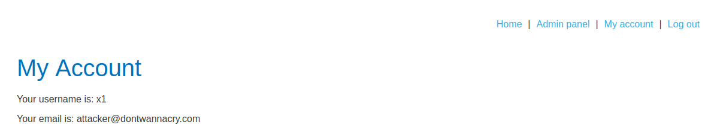

# Lab: Inconsistent security controls

Lab-Link: <https://portswigger.net/web-security/logic-flaws/examples/lab-logic-flaws-inconsistent-security-controls>  
Difficulty: APPRENTICE  
Python script: [script.py](script.py)  

## Known information

- Logic flaw allows any user access to admin features that should only be available to employees
- Goals:
  - Access admin panel
  - Delete user carlos

## Steps

### Analysis

The web application is the web shop known from the previous labs. I can register a new account and see that employees of DontWannaCry should use their company email. The long email was focus of the [previous lab](../Inconsistent_handling_of_exceptional_input/README.md) so I do not try it here, the null byte attempt that I tried there I quickly tried here as well and it failed again.

So I register a new account with my known email address, get the account registration email and log in to my account.

### Change of email address

On the `my account` page, I notice can update my email address. What happens if I simply change it to a `@dontwannacry.com` one?

Turns out my email is updated and I have a new `Admin panel` link in the header. Go there to delete `carlos` and

