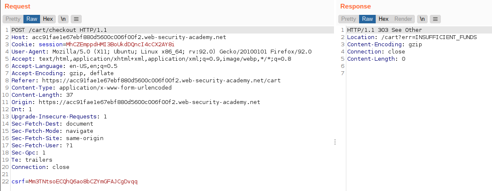
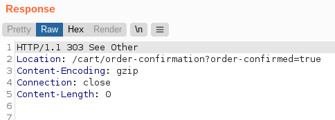
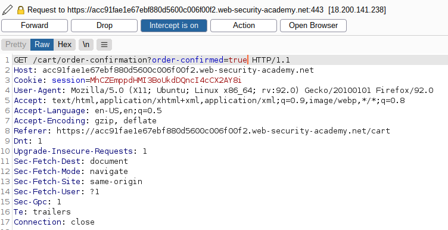
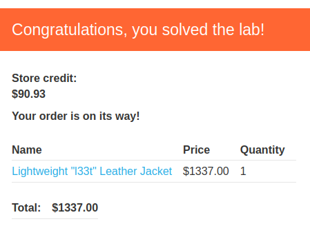

# Lab: Insufficient workflow validation

Lab-Link: <https://portswigger.net/web-security/logic-flaws/examples/lab-logic-flaws-insufficient-workflow-validation>  
Difficulty: PRACTITIONER  
Python script: [script.py](script.py)  

## Known information

- Application makes flawed assumption about workflow sequence
- Known credentials `wiener:peter`
- Goals:
  - Purchase a "Lightweight l33t leather jacket"

## Steps

### Analysis

From the description this lab uses the already well known web shop application again. First to have a quick look around for new features, than I login to my account. As usual, I have a \$100 store credit and need to purchase an article for much more than that.

When trying to purchase it, I get an expected `Not enough store credit for this purchase` error. Looking into the requests in Burp, I notice something odd though:

The checkout generates a `303 See Other` response, which instructs my browser to follow up with a GET to the indicated page. The interesting part here is, that the location includes a logical workflow status - the fact that I have not enough funds. I wonder what happens if I purchase something that I can afford:

Here, the redirect goes to another page with an order confirmation.

Let's try to purchase the jacket again, but intercept the calls and change the redirect destination.

After all the requests went through, the lab shows:

