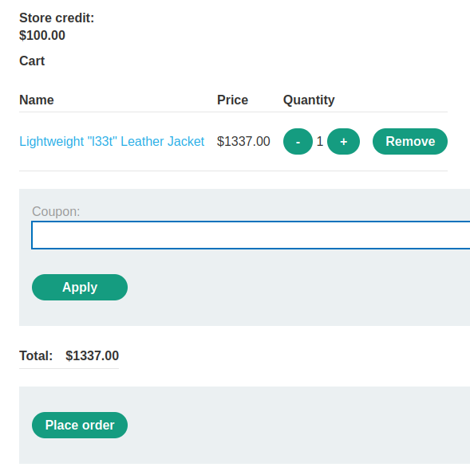
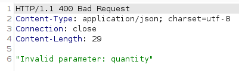
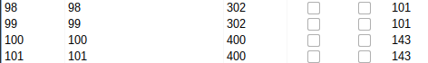
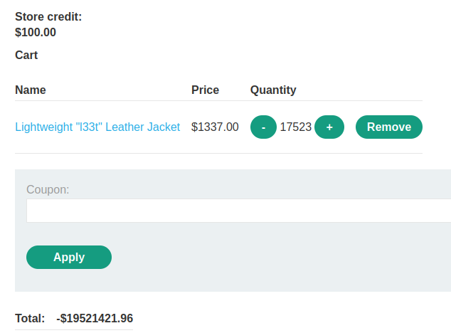
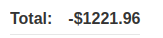
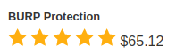
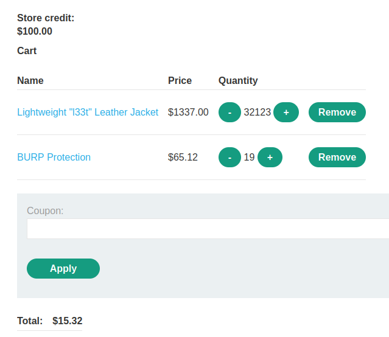
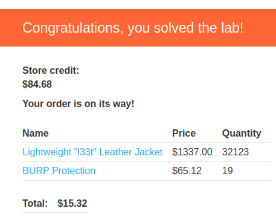

# Lab: Low-level logic flaw

Lab-Link: <https://portswigger.net/web-security/logic-flaws/examples/lab-logic-flaws-low-level>  
Difficulty: PRACTITIONER  
Python script: [script.py](script.py)  

## Known information

- Lab application does not adequately validates user input
- Logic flaw in the purchasing workflow
- Login credentials `wiener:peter`
- Goals:
  - Purchase a "Lightweight l33t leather jacket"

## Steps

### Analysis

As usual I have a look at the website and I am greeted by the same shop website as in the previous labs. The available store credit is still not enough to buy the jacket. What is new in this iteration of the lab is the introduction of a coupon input field, which I suspect is where the vulnerability lies:

Entering some random coupon value and try to apply just yields an 'Invalid coupon' response:

Unfortunately, I don't know the format of valid coupons, and I can't find any information about this. So perhaps going this coupon field is a rabbit hole to chase down, but nothing that leads to a result.

One other thing that I tried in the previous lab without success was trying to create an overflow in the price, i.e. adding thousands of jackets in order to let the total price exceed the value range of the variable. If the data type used is a signed type, than the next number after the biggest positive number is the lowest possible negative number.

So I intercept the request to add a jacket to the cart, send it to repeater and modify the amount to 10000 (with the intend to increase the cart value in 10M increments).

The applications response was that it did not like the quantity:

Perhaps another rabbit hole, perhaps the solution. Lets find out...

### Find suitable values for adding to cart

Sending the request to Burp Intruder abd add the quantity value as payload.

- Attack type: **Sniper**
- Payload: Numbers, 1-1000, step 1

When the payload reaches 100, the response changes from the normal `302 Found` to the `400 Bad Request`. The maximum number of items that can be added to the cart is therefore 99.

### Provoking an overflow

While trying this, the total value of my cart increased to more than 6 million $ for almost 5000 jackets. In Burp Intruder, set the quantity of the request to 99, add a Null payload and continue indefinitely. To be able to observe the website, I also only allow a single concurrent request in the resource pool.

- Attack type: **Sniper**
- Payload: Null payloads, continue indefinitely
- Resource Pool: 1 concurrent request

After a couple of refreshes while Burp Intruder sends its request, the page shows a negative number:

Trying to order now (who would not want 17 thousand jackets and a spare 19 million dollar) is prevented by the application (unfortunately):

### Adjusting the total value

The cart has now a value of negative 19 million. Adding another 14600 jackets brings the price to \$-1221, adding another one on top of that ups the total to \$116. The former is not allowed, the latter exceeds the available money. So I will add the 14600 jackets and find some other product to bring the total price in the range between zero and \$100.

In Burp Intruder, repeat the zero payloads another 147 times (Burp sends one request without payload, so I generate just 146 payloads - I guess that behaviour can be changed but I did not find the option right away)

My total cart value is just shy of negative \$1222. So I search an article that I can use to bring the total to an acceptable value. I settle for

It has brilliant ratings, and protection against BURP is always welcome (who knows what might end up on the inside of my mask).

So I need to add 19 of them to bring the total to \$15.28, which can be done straight away without any BURP interaction.

### Purchase

After placing the order I get a confirmation that I

1. Get some parcels soon
2. Need to get a bigger home
3. Start a major leather jacket selling business and make a fortune
4. Solved the lab

