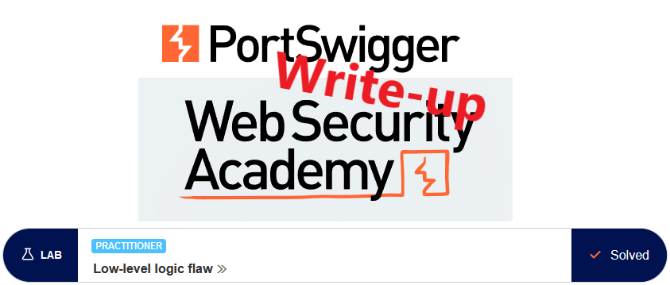
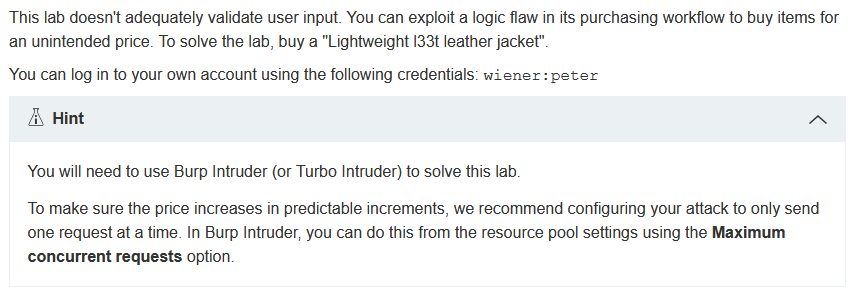
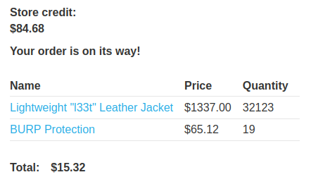

# Write-up: Low-level logic flaw @ PortSwigger Academy

This write-up for the lab *Low-level logic flaw* is part of my walkthrough series for [PortSwigger's Web Security Academy](https://portswigger.net/web-security).

**Learning path**: Server-side topics → Business logic vulnerabilities

Lab-Link: <https://portswigger.net/web-security/logic-flaws/examples/lab-logic-flaws-low-level>  
Difficulty: PRACTITIONER  
Python script: [script.py](script.py)  

## Lab description

## Steps

### Analysis

The first step, as usual, is the analysis of the website, in this case, a webshop. I need to purchase an item, so I log into the account of `wiener` with the credentials provided. 

Unfortunately, the store credit available is not enough to buy the jacket.

The cart has the option to redeem a coupon code. Entering some random coupon value and applying just yields an 'Invalid coupon' response:

I don't know the format of valid coupons and I can't find any information about this. Perhaps this coupon field is there as a rabbit hole to chase down, but nothing that leads to a result.

Another thing worth trying is attempting to create an overflow with the price. The price is stored in some type of numeric variable. Once it exceeds the maximum value, it usually overflows to the lowest possible value and continues to count up from there:

| current value |  new value after calculating +1
| -- | -- |
| 1 | 2 |
| 2 | 3 | 
| max_value | min_value |
| min_value | min_value + 1 |

Of course, the exact values for `min_value` and `max_value` depend on the data types used and could range into very, very high numbers.

Applications should include something in their logic to prevent this behavior. But let's try out.

I intercept the request to add a jacket to the cart. It contains a `quantity` parameter, indicating that I can add more than one item. 

I send it to Repeater and modify the amount to 10000 (to increase the cart value in 10M increments). The application responded that it did not like the quantity:

---

### Find suitable values for adding to the cart

I need to find out what the maximum increment allowed is, so I send the request to Burp Intruder and add the quantity value as payload.

- Attack type: **Sniper**
- Payload: Numbers, 1-1000, step 1

When the payload reaches 100, the response changes from the normal `302 Found` to the `400 Bad Request`. The maximum number of items that can be added to the cart is therefore 99.

---

### Provoking an overflow

While trying this, the total value of my cart increased to more than 6 million $ for almost 5000 jackets. In Burp Intruder, set the quantity of the request to 99, add a Null payload and continue indefinitely. To be able to observe the website, I also only allow a single concurrent request in the resource pool.

- Attack type: **Sniper**
- Payload: Null payloads, continue indefinitely
- Resource Pool: 1 concurrent request

After a couple of refreshes while Burp Intruder sends its request, the page shows a negative number:

I try to order now, who would not want 17 thousand jackets and a spare 19 million dollars? Unfortunately, it is prevented by the application:

---

### Adjusting the total value

The cart has now a value of negative 19 million. Adding another 14600 jackets brings the price to \$-1221, adding another one on top of that ups the total to \$116. The former is not allowed, the latter exceeds the available money. So I will add the 14600 jackets and find some other product to bring the total price in the range between zero and \$100.

In Burp Intruder, I repeat the zero payloads another 147 times (Burp sends one request without payload, so I generate just 146 payloads.

My total cart value is just shy of negative \$1222. So I search for an article that I can use to bring the total to an acceptable value. I settle for

It has brilliant ratings, and protection against BURP is always welcome. 

I need to add 19 of them to bring the total to \$15.28:

---

### Purchase

After placing the order I get a confirmation that I

1. Get some parcels soon
2. Need to get a bigger home
3. Start a business selling major leather jacket
4. Solved the lab

Point 4 is also highlighted by the lab application that updates to

