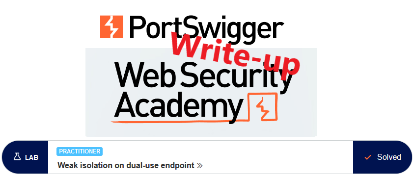
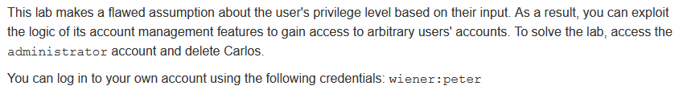
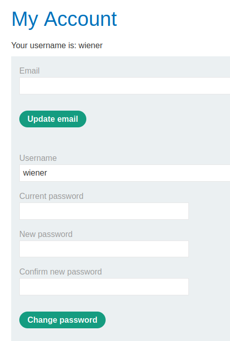
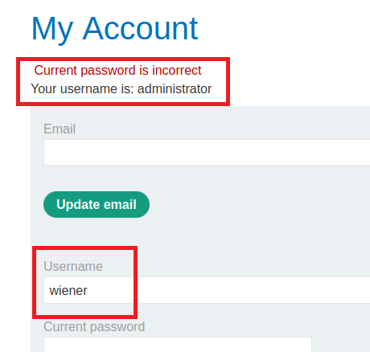
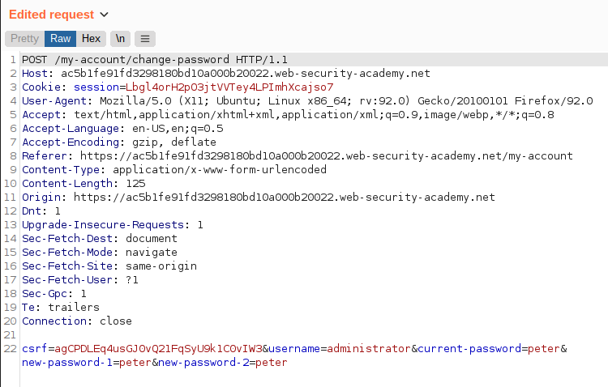
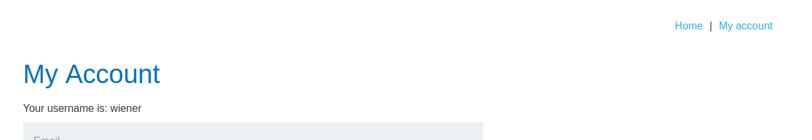
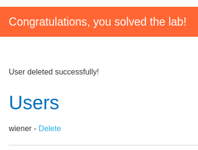

# Write-up: Weak isolation on dual-use endpoint @ PortSwigger Academy

This write-up for the lab *Weak isolation on dual-use endpoint* is part of my walkthrough series for [PortSwigger's Web Security Academy](https://portswigger.net/web-security).

**Learning path**: Server-side topics → Business logic vulnerabilities

Lab-Link: <https://portswigger.net/web-security/logic-flaws/examples/lab-logic-flaws-weak-isolation-on-dual-use-endpoint>  
Difficulty: PRACTITIONER  
Python script: [script.py](script.py)  

## Lab description

  
## Steps

### Analysis

As usual, the first step is to analyze the website, in this case, a blog system. After browsing a bit, I log in with the known credentials of `wiener`.

One thing that catches my eye is the password change functionality:

Why does it contain the username as an input field? What happens if I use it and simply change the username to `administrator`?

From this result I can derive a few pieces of information:

1. The password change failed due to a wrong current password.
2. The password comparison was not performed with the password account that is logged in but with the password of the account set in `Username`
3. At the point the 'Update password' form was generated, the application did use the logged-in user again.

I'd expect either the password to be changed for the logged-in user, `wiener`. In this case, the input field for the username would be unnecessary.

But at some point during the generation of the response, the application assumed that my username is `administrator`. This points to some weird logic behind the scenes that warrant further investigation.

To verify that no password was changed despite the error message, I attempt to log in with both `wiener` and `administrator` using the newly set password. It fails as expected.

---

### Analyzing the traffic

I move over to Burp to have a look at what all the requests look like:

OK, so I have the csrf token, username and the three password parameters. 

While the application generated the response, at the moment my username was embedded, I was the `administrator` user. I was also considered `administrator` while the current password was checked and the error message got inserted. As such, the password change failed as it was not the correct password for that user.

So what happens if I remove the current password from the form? 

This depends on whether it always checks the current password on password change. If this is the case, then it will fail as well, as it should.

However, if the password check only occurs when the parameter is present, then it will be bad for the application but good for me.

---

### Omitting the current password

It is easy to find out, so I intercept the request and remove the current password:

Interestingly, the `my-account` page still states that I am `wiener` but I notice that I do not have a logout link. Reloading the page brings it back. Something happened with the response to my password change request that was not following the normal workflow.

Try to logout and login again, this time with the credentials `administrator:peter`:

And I appear to be inside the administrator account. The application states that my username is `administrator` and it provides me with a link to an `Admin panel`. I access it, delete `carlos` and receive a confirmation:

At the same time, the lab updates to

