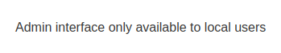
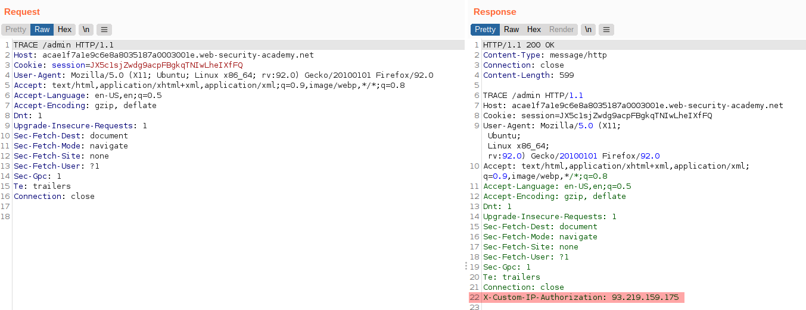
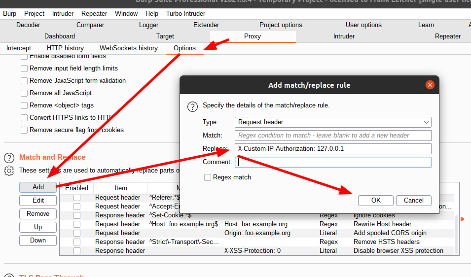
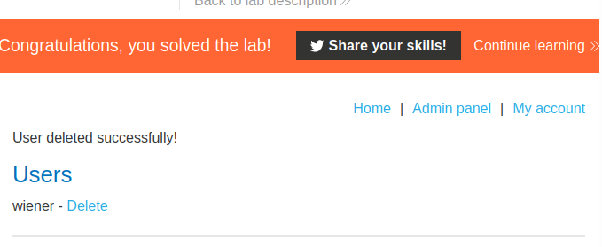

# Lab: Authentication bypass via information disclosure

Lab-Link: <https://portswigger.net/web-security/information-disclosure/exploiting/lab-infoleak-authentication-bypass>  
Difficulty: APPRENTICE  
Python script: [script.py](script.py)  

## Known information

- Admin interface authentication bypass
- Requires knowledge of a custom HTTP header
- Known credentials `wiener:peter`
- Goals:
  - Obtain HTTP header name
  - Access admin interface
  - Delete account `carlos`

## Steps

### Analysis

As usual, the first step is checking the website. It is again the shop website with interesting products.

After browsing around a bit and logging in with the known credentials, nothing too interesting appears. Time to check the requests in Burp. Nothing too interesting there either.

In some previous labs, the admin interface was found under `/admin`. So either with guessing, or by content discovery methods, I visit this page to receive this message:

No more information are given. A common way of propagating originating IPs to a web server (using in proxy or load balancing scenarios) is the `X-Forwarded-For` header. This, however, does not work here (and the lab description states it is a custom header anyway).

There are two HTTP verbs that can be used to obtain additional information, `OPTIONS` and `TRACE`. The latter one produces this result:

### Supply custom header

Now that I know the header, accessing the admin interface becomes easy. To ensure the custom header is sent with each request, I add a rule to always add this new header to requests:

Now just reload the page in the browser, access the admin panel and delete user `carlos` to solve the lab:

