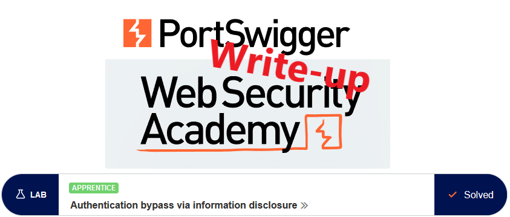
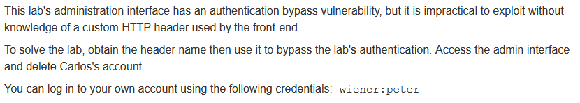
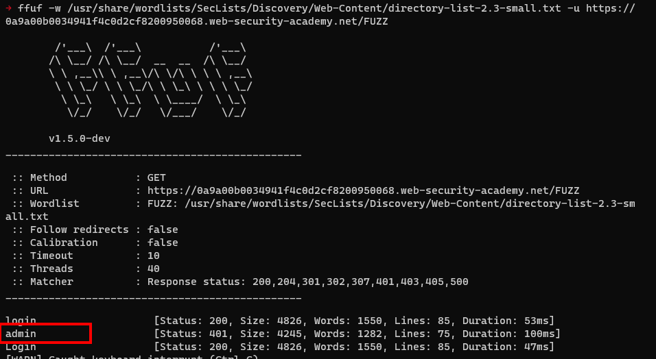

# Write-up: Authentication bypass via information disclosure @ PortSwigger Academy

This write-up for the lab *Authentication bypass via information disclosure* is part of my walkthrough series for [PortSwigger's Web Security Academy](https://portswigger.net/web-security).

**Learning path**: Server-side topics → Information disclosure

Lab-Link: <https://portswigger.net/web-security/information-disclosure/exploiting/lab-infoleak-authentication-bypass>  
Difficulty: APPRENTICE  
Python script: [script.py](script.py)  

## Lab description

## Steps

### Analysis

The lab application is a shop website with very interesting products. As usual, the first step is checking the website.

After browsing around a bit and logging in with the known credentials, nothing too interesting appears. Time to check the requests in Burp. Nothing too interesting there either.

The admin endpoint in some previous labs was found under `/admin`. But to avoid using this knowledge, I can use multiple means of content discovery. Burp Professional comes with such functionality and several good free tools allow for content discovery as well.

The one I use here is [ffuf](https://github.com/ffuf/ffuf) together with the great wordlists provided by [SecLists](https://github.com/danielmiessler/SecLists):

---

### Visiting the endpoint

I visit this page to receive this message:

No more information is given. 

A common way of propagating originating IPs to a web server (used in proxy or load balancing scenarios) is the `X-Forwarded-For` header. This, however, does not work here (and the lab description states it is a custom header anyway).

Two HTTP verbs can be used to obtain additional information, `OPTIONS` and `TRACE`. The latter produces an interesting result:

---

### Supply custom header

Now that I know the header, accessing the admin interface becomes easy. I need to ensure the custom header is sent with each request so I add a `Match and Replace` rule to always add this new header to requests. 

I use `127.0.0.1` as the content to trick the application to believe that the request originated from `localhost`.

Now just reload the page in the browser, access the admin panel and delete user `carlos` to solve the lab:

