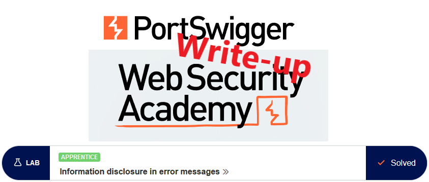
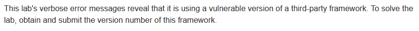

# Write-up: Information disclosure in error messages @ PortSwigger Academy

This write-up for the lab *Information disclosure in error messages* is part of my walkthrough series for [PortSwigger's Web Security Academy](https://portswigger.net/web-security).

**Learning path**: Server-side topics → Information disclosure

Lab-Link: <https://portswigger.net/web-security/information-disclosure/exploiting/lab-infoleak-in-error-messages>  
Difficulty: APPRENTICE  
Python script: [script.py](script.py)  

## Lab description

## Steps

### Analysis

The lab application is a webshop. Some, mainly older, frameworks added their comment to the HTML source providing useful information. 

In this case, however, the HTML source of the page does not reveal anything of interest.

Browsing around a bit, not many options are noticeable to provide input. In fact, only the `productId` parameter when viewing product details is apparent.

What happens when I modify it?

---

### Modifying parameter

First I try to use a productId that does not exist:

The application gently tells me that it did not find anything. So retry it again with some non-numeric value of the parameter:

The application does not handle this error gracefully and reveals the full exception including the vulnerable version of Apache Struts 2.

After submitting the solution, the lab updates to

