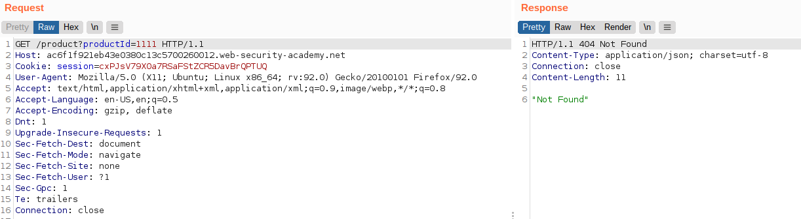
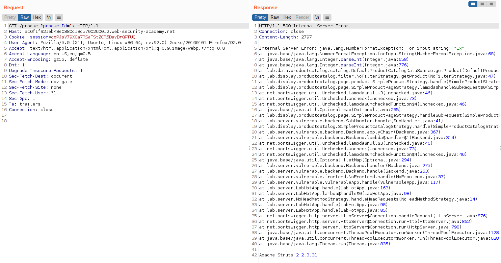

# Lab: Information disclosure in error messages

Lab-Link: <https://portswigger.net/web-security/information-disclosure/exploiting/lab-infoleak-in-error-messages>  
Difficulty: APPRENTICE  
Python script: [script.py](script.py)  

## Known information

- Lab contains vulnerable version of third-party framework
- Goals:
  - Obtain and submit version number

## Steps

### Analysis

This lab contains again the best of all webshops. Just this time without the ability to purchase anything.

Browsing around a bit, not much options are noticable to provide input. In fact, only the `productId` parameter when viewing product details are apparent.

So what happens when I modify it?

### Modifying parameter

First I try to use a productId that does not exist:

The application gently tells me that it did not found anything. So retry it again with some non-numeric value of the parameter:

The application does not handle errors gracefully, revealing the full exception including the vulnerable version of Apache Struts 2 2.3.31.

The only thing missing now is submitting the solution to solve the lab.

