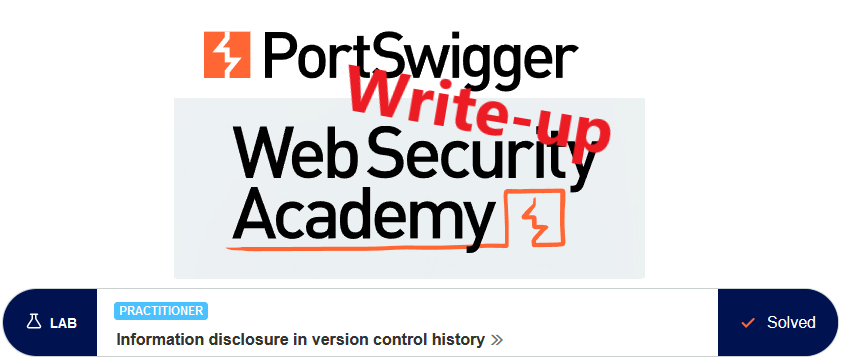
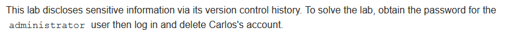
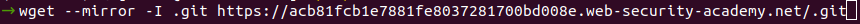
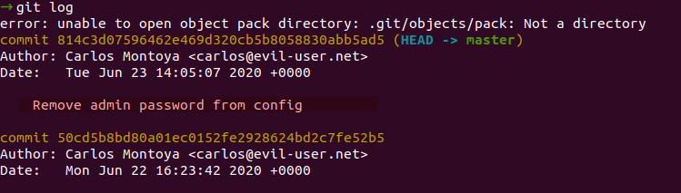
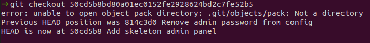
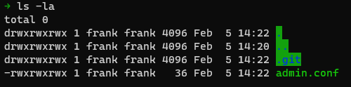
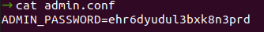
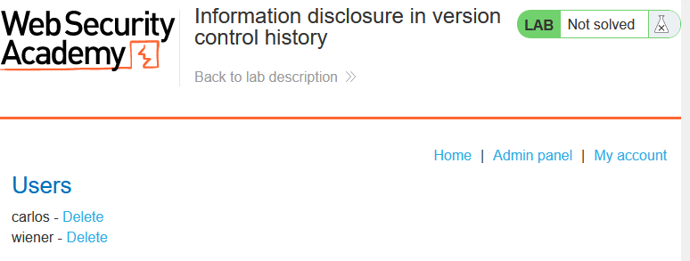
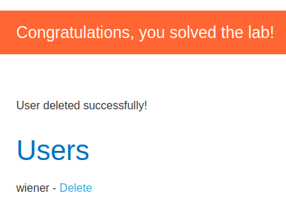

# Write-up: Information disclosure in version control history @ PortSwigger Academy

This write-up for the lab *Information disclosure in version control history* is part of my walkthrough series for [PortSwigger's Web Security Academy](https://portswigger.net/web-security).

**Learning path**: Server-side topics → Information disclosure

Lab-Link: <https://portswigger.net/web-security/information-disclosure/exploiting/lab-infoleak-in-version-control-history>  
Difficulty: PRACTITIONER  
Python script: [script.py](script.py) 
*The script is not platform-independent. It works on Linux and perhaps on Mac. To run it on Windows, it requires WSL (it may run on Cygwin or similar Linux-like environments).*

## Lab description

## Steps

As usual, the first step is to analyze the functionality of the lab application. In this lab, it is a shop website.

Browsing around does not reveal anything unusual. As I do not have any known credentials, I need additional means of finding content.

This can be a wild guess based on the title, Burp's content discovery or any other directory search tool (e.g. [gobuster](https://github.com/OJ/gobuster), [wfuzz](https://github.com/xmendez/wfuzz), ...). Very quickly, it discovers an interesting directory:

I quickly mirror the directory with wget to create a local copy with the following line:

Now I change into that directory, check the git log and find an interesting commit message in the last commit:

So I move my working directory back to the commit before that:

A quick directory listing shows an interesting file with even more interesting content:

Now it is simply a matter of logging in with `administrator:xdewmitje2uxb30llr06` and accessing the `Admin panel`:

After I delete user `carlos`, the lab updates to

