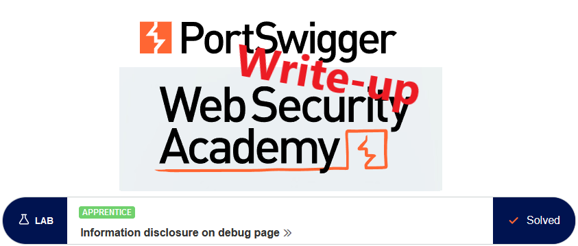
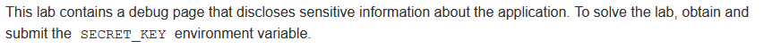
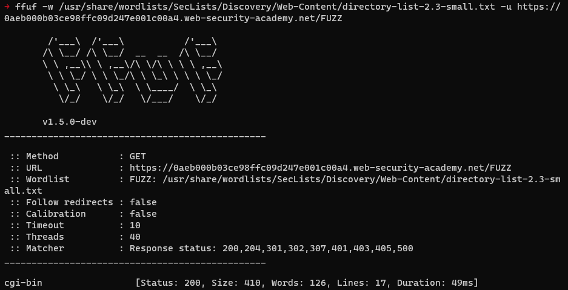
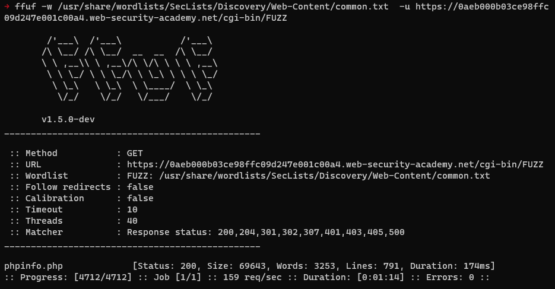

# Write-up: Information disclosure on debug page @ PortSwigger Academy



This write-up for the lab *Information disclosure on debug page* is part of my walkthrough series for [PortSwigger's Web Security Academy](https://portswigger.net/web-security).

**Learning path**: Server-side topics → Information disclosure

Lab-Link: <https://portswigger.net/web-security/information-disclosure/exploiting/lab-infoleak-on-debug-page>  
Difficulty: APPRENTICE  
Python script: [script.py](script.py)  

## Lab description



## Steps

The lab application is a shop website that is already well-known from other labs. Looking at the page does not reveal anything interesting.

Below, I show finding the target file using both the commercial Burp Professional as well as free tools outside of Burp.

---

### Using Burp Professional

Using the Burp Content Discovery feature quickly shows the file as well:


---

### Using free tools

When I try to avoid using features from Burp Professional, several good free tools allow for content discovery. The one I use here is [ffuf](https://github.com/ffuf/ffuf) together with the great wordlists provided by [SecLists](https://github.com/danielmiessler/SecLists).

First, I search for common directories within the web root of the application with 

```
ffuf -w /usr/share/wordlists/SecLists/Discovery/Web-Content/directory-list-2.3-small.txt -u https://0aeb000b03ce98ffc09d247e001c00a4.web-security-academy.net/FUZZ
```



I can now search within this directory for common files with 

```
ffuf -w /usr/share/wordlists/SecLists/Discovery/Web-Content/common.txt  -u https://0aeb000b03ce98ffc09d247e001c00a4.web-security-academy.net/cgi-bin/FUZZ
```



---


## Finding the secret

Opening this file in the browser and scrolling through the content quickly shows the answer:


After submitting the solution, the lab updates to


