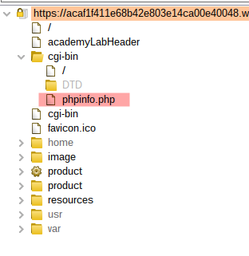
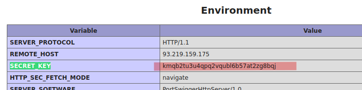

# Lab: Information disclosure on debug page

Lab-Link: <https://portswigger.net/web-security/information-disclosure/exploiting/lab-infoleak-on-debug-page>  
Difficulty: APPRENTICE  
Python script: [script.py](script.py)  

## Known information

- Lab contains a debug page disclosing information about the application
- Goals:
  - Obtain and submit content of the `SECRET_KEY` environment variable

## Steps

### Analysis

The page is again the well known shop website. Looking at the page does not reveal anything interesting.

Using Burp Content Discovery feature quickly shows an interesting file:

Opening this file in the browser and scrolling through the content quickly shows the answer:

Submit the solution to solve the lab

