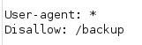
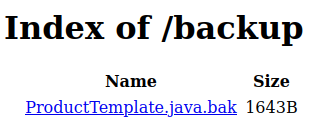
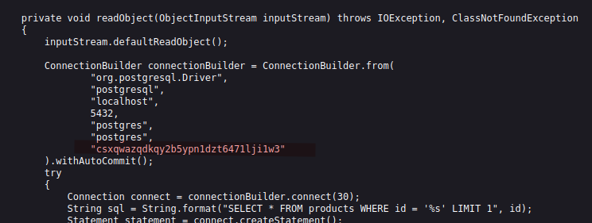

# Lab: Source code disclosure via backup files

Lab-Link: <https://portswigger.net/web-security/information-disclosure/exploiting/lab-infoleak-via-backup-files>  
Difficulty: APPRENTICE  
Python script: [script.py](script.py)  

## Known information

- Lab leaks source code in a backup file
- Database password is hardcoded in source code
- Goals:
  - Submit database password

## Steps

### Analysis

When analysing a web page, one of the first steps is to check the `robots.txt` file for any interesting location. That file instructs search engine crawlers on which content should be included or excluded from the crawler (it is up to the crawler whether they actually obey these instructions).

In this case, it points straight to the subdirectory `/backup` (other means to discover it would be tools like Burp Content Discovery, gobuster, wfuzz, ...)

Checking the directory shows a backup file for some Java code:

In the code, the credentials for the database connections can be found:

Submit the value to solve the lab.
