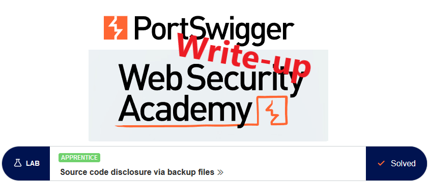
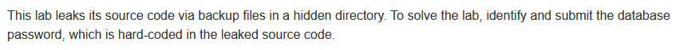
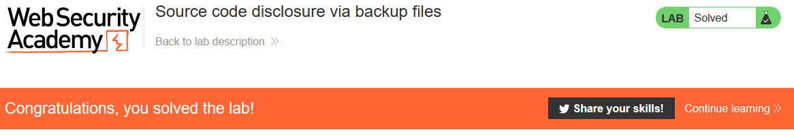

# Write-up: Source code disclosure via backup files @ PortSwigger Academy

This write-up for the lab *Source code disclosure via backup files* is part of my walkthrough series for [PortSwigger's Web Security Academy](https://portswigger.net/web-security).

**Learning path**: Server-side topics → Information disclosure

Lab-Link: <https://portswigger.net/web-security/information-disclosure/exploiting/lab-infoleak-via-backup-files>  
Difficulty: APPRENTICE  
Python script: [script.py](script.py)  

## Lab description

## Steps

When analyzing a web page, one of the first steps is always to check for the existence of a `robots.txt` file. 

It is a file that requests search engine crawlers to either include or exclude certain parts of the site from their index. Sometimes, interesting locations are revealed that way.

It is up to the crawler whether they obey these wishes or ignore them. As the file is plain text, the same applies to any human reading it.

In this case, it points straight to the subdirectory `/backup` (other means to discover it would be tools like Burp Content Discovery, gobuster, wfuzz, ...)

Checking the directory shows a backup file for some Java code:

In the code, the credentials for the database connections can be found:

After submitting the solution time, the lab updates to

