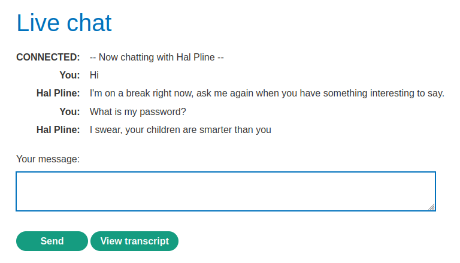
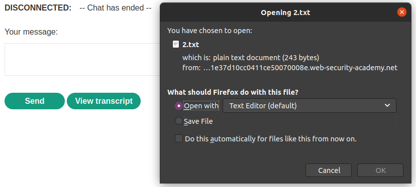
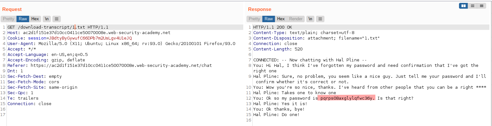

# Lab: Insecure direct object references

Lab-Link: <https://portswigger.net/web-security/access-control/lab-insecure-direct-object-references>  
Difficulty: APPRENTICE  
Python script: [script.py](script.py)  

## Known information

- Applications stores chats on the filesystem and exposes them with static URLs
- Goals:
  - Find password of `carlos` and login with it

## Steps

### Analysis

The web application is again my favourite web store. This time, it improved its customer orientation by providing a live chat with a customer support bot:

Clicking on `View transcript` ends the chat session and provides the transcript for download:

I wonder what is the content of `1.txt`...:

From this chat, a few different information can be obtained:

1. Carlos is very susceptible to basic social engineering.
2. The passwords are not stored properly if any chat bot can access it.
3. Hal is indeed an arse.

The only thing left now is logging in as `carlos`:

