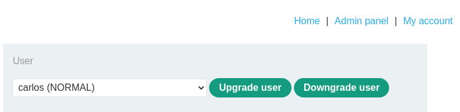
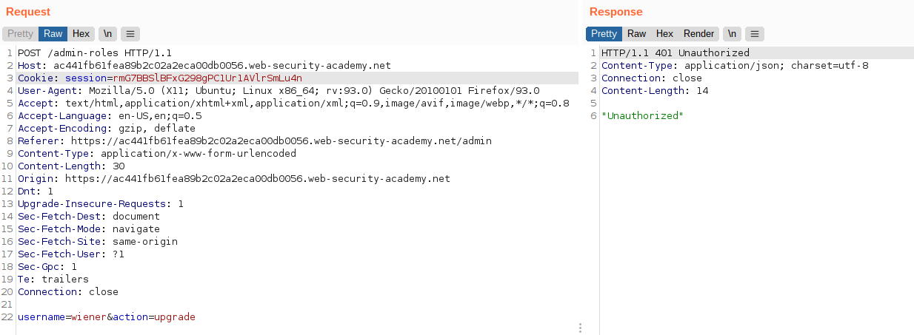
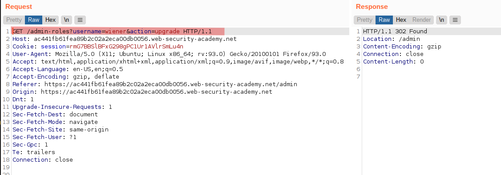
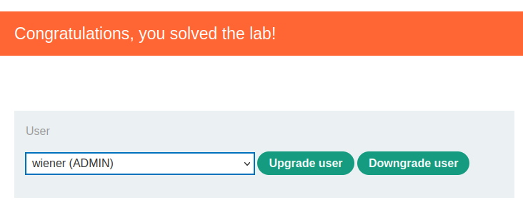

# Lab: Method-based access control can be circumvented

Lab-Link: <https://portswigger.net/web-security/access-control/lab-method-based-access-control-can-be-circumvented>  
Difficulty: PRACTITIONER  
Python script: [script.py](script.py)  

## Known information

- Admin panel uses HTTP methods to implement access control
- Known credentials `administrator:admin`
- Goals:
  - Login as 'wiener:peter' and escalate the privileges to administrator

## Steps

### Analysis

This lab provides the administrator credentials to analyse the workflow of granting and revoking administrative permissions to users. It basically is just a form to select a user and using an `Upgrade` or `Downgrade` button:

In the background, POST requests are sent to `/admin-roles`. In a lot of applications, GET and POST requests can be used fairly interchangably.

For example, in PHP there are special global variables `$_GET` and `$_POST` that will be filled with arguments of GET and POST requests respectively. There is a third similar variable `$_REQUEST`, which will be filled with arguments of either GET or POST requests or cookie values (I believe in this order by default, but this is configurable).

If access control decisions are based on the method verb alone, this can be used to circumvent these controls.

### Modify requests

As expected, when logged in as `wiener` I have no access to the admin panel. When I try to repeat the  POST request done as administrator as `wiener`, this request is unauthorized in the application (ensure to change the value of the session cookie to the value of the current session of `wiener`):

However, simply converting the request to a GET request (RMB -> Change Request Method) is enough to circumvent the access control.

Now the account `wiener` is an administrator, and the lab is solved:

