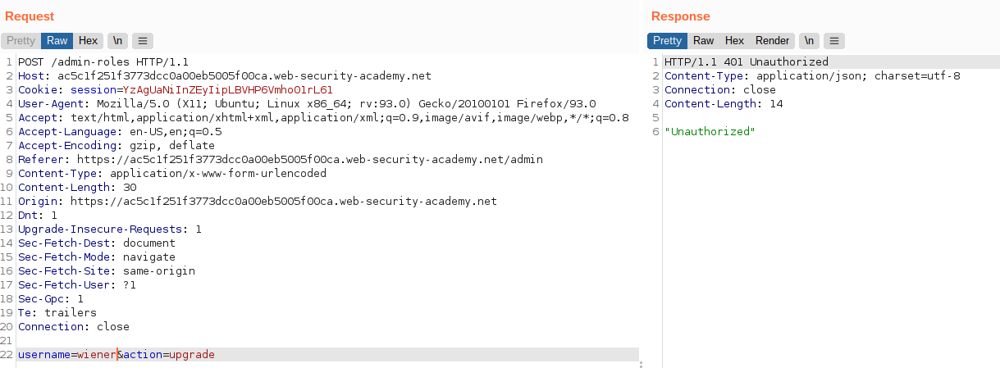
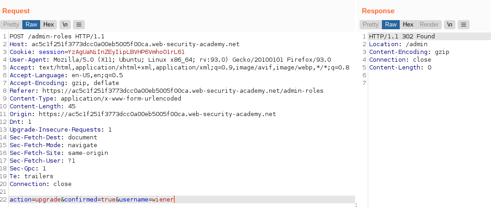
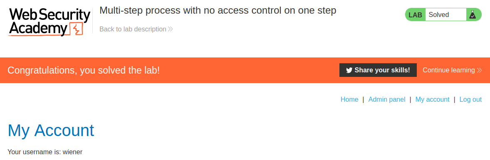

# Lab: Multi-step process with no access control on one step

Lab-Link: <https://portswigger.net/web-security/access-control/lab-multi-step-process-with-no-access-control-on-one-step>  
Difficulty: PRACTITIONER  
Python script: [script.py](script.py)  

## Known information

- Application has a multi-step process for changing user roles
- Provided credentials `administrator:admin` and `wiener:peter`
- Goals:
  - Login as `wiener` and elevate privileges to administrator privileges.

## Steps

### Analysis

As a first step I log into the administrator account to analyse the process of changing user roles. The role change is done in two steps:

1. Select upgrade or downgrade option for a user
2. Confirm this on a second page

Both requests are done by POST to `/admin-roles`. The first request contains the data e.g. `username=carlos&action=upgrade`, while the second one contains `action=upgrade&confirmed=true&username=carlos`. These two requests should be orchestrated on the server side, and both must be authorized individually.

### Doing these steps as wiener

Now I try to repeat these steps as `wiener`, sending the requests to Repeater and ensuring my session cookie matches the session of `wiener`:

The first request properly authorizes the request, responding with a `401 Unauthorized` error.

However, sending the second request behaves differently:

This request is not authorized by the server but taken and processed as-is, trusting on the fact that the first request comes first and is authorized. Knowing the process makes exploiting this flaw trivial, completely bypassing the authorization and changing the permissions directly.

Sending the request above was enough, a simple refresh in the browser shows the solved lab:

