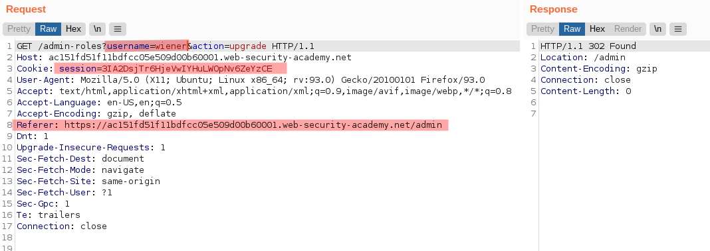
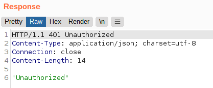
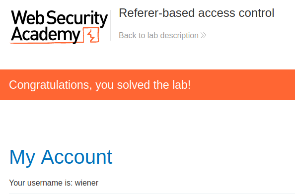

# Lab: Referer-based access control

Lab-Link: <https://portswigger.net/web-security/access-control/lab-referer-based-access-control>  
Difficulty: PRACTITIONER  
Python script: [script.py](script.py)  

## Known information

- Application uses Referer header for access control
- Known credentials `administrator:admin` and `wiener:peter`
- Goals:
  - As `wiener`, escalate the privileges to administrator

## Steps

### Analysis

The first step is analysis of the website, especially the logged in features. As expected, the administrator has access to the admin panel, `wiener` has not. Going to `/admin` manually results in the error message `Admin interface only available if logged in as an administrator`. Next is to check the requests and responses of these interactions

The main visible difference is the existance of the referrer header for admin, while manually browsing to `/admin` has none. Referers are added by the browser automatically (unless requested not to) everytime a link in the page is used.

Of course, the headers can be changed easily, so any header information is untrusted and has to be validated thoroughly by the server. It must not be the unique source of truth for any authorization activities on the server. The most it may be used is as **additional** sanity check - if anything looks like it was tempered with, terminate the session.

If the server authorisation logic is like 'the request has a referer, so it used a link and the link is only there for administrators' than there are numerous ways to defeat it, the easiest is using an intercepting proxy like Burp.

### Add header to admin call

The authorization to the admin panel itself is not based on the Referer, so the panel itself can not be accessed. For operations on the panel, namely the upgrade and downgrade of users, this is different.

Upgrading a user works by calling `/admin-roles?username=carlos&action=upgrade`. While logged in as admin user, this worked fine. Logged in as `wiener`, I can simply send the admin request to Repeater and change the cookie value to the session of `wiener`:

For reference, sending the very same request again without the referer header results in an `401 Unauthorized` error, confirming that the referer header is used as only source of truth for the authorization:

Reloading the page in the browser results in:

