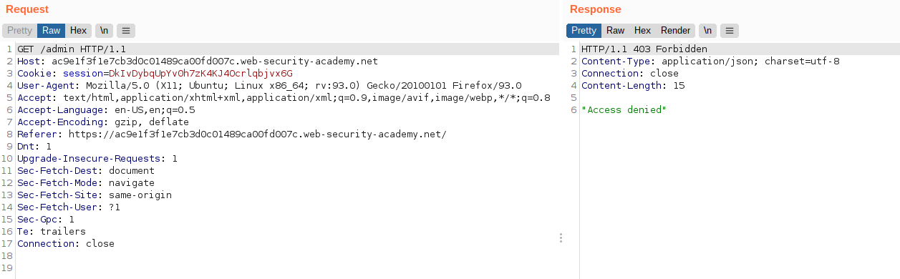
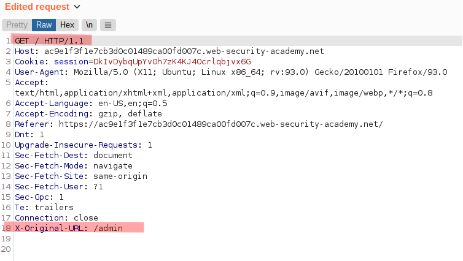
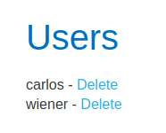
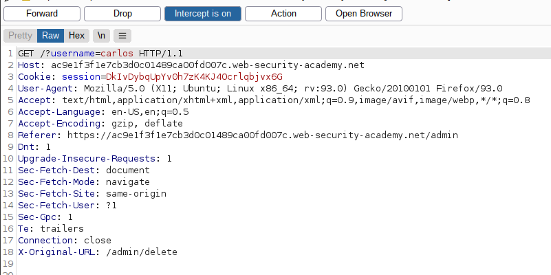
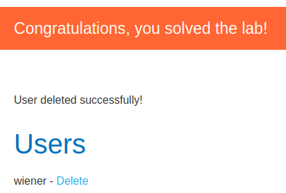

# Lab: URL-based access control can be circumvented

Lab-Link: <https://portswigger.net/web-security/access-control/lab-url-based-access-control-can-be-circumvented>  
Difficulty: PRACTITIONER  
Python script: [script.py](script.py)  

## Known information

- Application has an admin panel at `/admin`
- Unauthenticated access is possible, but external access to path is blocked
- Backend application allows custom header `X-Original-URL`
- Goals:
  - Access admin panel and delete user `carlos`

## Steps

### Analysis

The lab description basically states the solution directly. Trying to access the `/admin` path, the access is denied by a plain json message:

However, using a modified requests that requests `/` instead and uses the destination path in the `X-Original-URL` header, it results in the admin panel.

Deleting user `carlos` is now easy by intercepting the request and move the path to the `X-Original-URL` header. The URL parameters need to remain in the URL as they are not part of the path.

Returning back to the admin panel (modify request again) confirms that the user was deleted and the lab is solved:

