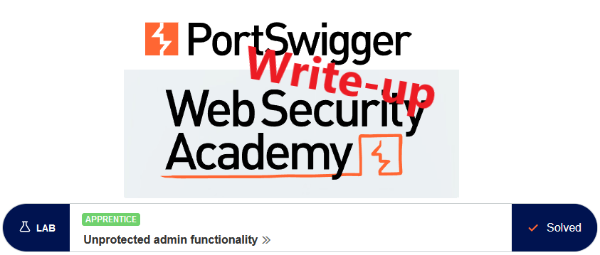
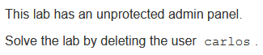
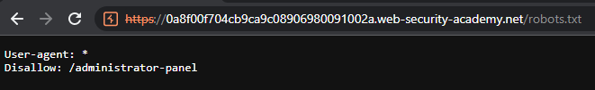
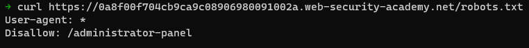
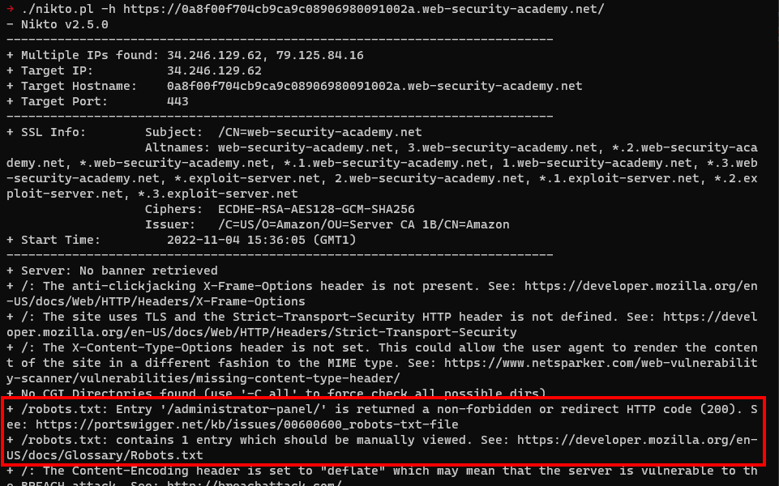
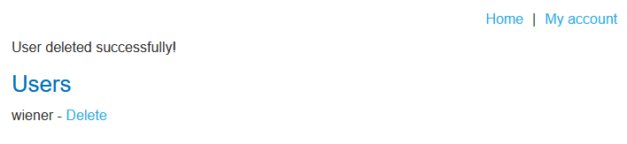

# Write-up: Unprotected admin functionality @ PortSwigger Academy

This write-up for the lab *Unprotected admin functionality* is part of my walkthrough series for [PortSwigger's Web Security Academy](https://portswigger.net/web-security).

**Learning path**: Server-side topics → Access control vulnerabilities

Lab-Link: <https://portswigger.net/web-security/access-control/lab-unprotected-admin-functionality>  
Difficulty: APPRENTICE  
Python script: [script.py](script.py)  

## Lab description

## Steps

The first step is to get an overview of the web application which is a shop website. 

One of the first things to do during website enumeration is to check for the existence of a robots.txt file. It is a file that requests search engine crawlers to either include or exclude certain parts of the site from their index. Sometimes, interesting locations are revealed that way.

It is up to the crawler whether they obey these wishes or ignore them. As the file is plain text, the same applies to any human reading it.

There are a ton of ways to detect the existence and content of this file.

---

### Manual browsing

I can just attempt to load the file in the browser to see if it exists and its content:

This can be done from the command line as quickly, for example with curl:

---

### Using tools

In any reasonable wordlist file, the `robots.txt` file is included as well. Regardless of the workflow used, any attacker will see this file in an instant like in this example using [gobuster](https://github.com/OJ/gobuster) together with a wordlist from [SecLists](https://github.com/danielmiessler/SecLists):

A lot of tools do it automatically. [Nikto](https://github.com/sullo/nikto), for example, is even kind enough to check whether the files or directories mentioned in the `robots.txt` file exist and reports the result directly in its output:

---

### Doing the harm

This file must not be used to 'protect' any files or directories. A 'disallow' is just a friendly request that spiders do not index these things. Whether to obey this request is up to the spider. Google & Co will, others less so. And anybody checking the file knows what is disallowed.

Solving the lab is as easy as visiting `https://0a8f00f704cb9ca9c08906980091002a.web-security-academy.net/administrator-panel` and clicking on `Delete` for user `carlos`:

At the same time, the lab updates to

