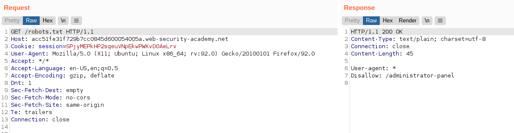
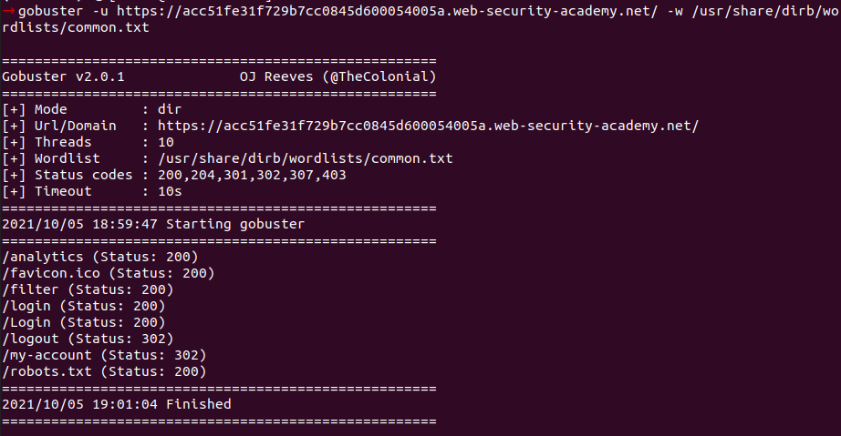
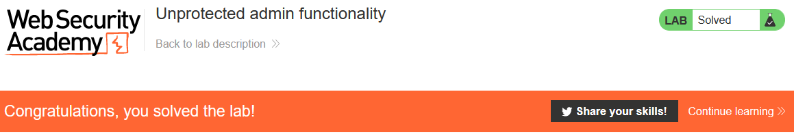

# Lab: Unprotected admin functionality

Lab-Link: <https://portswigger.net/web-security/access-control/lab-unprotected-admin-functionality>  
Difficulty: APPRENTICE  
Python script: [script.py](script.py)  

## Known information

- Lab has unprotected admin panel
- Goals:
  - Delete user `carlos`

## Steps

### Analysis

The first step is as usual to get an overview of the web application, which is again the shop website. One of the first things to do during website enumeration is checking for robots.txt. A lot of tools do it automatically, for example Burp or nikto.

With `curl https://acc51fe31f729b7cc0845d600054005a.web-security-academy.net/robots.txt` it can be done quickly from the command line as well.

In any wordlist file the robots.txt is included as well, so regardless of the workflow used, any attacker will see this file in an instant (and I just noticed Ubuntu 20.04 has an ancient version of gobuster):

It is common knowledge that this file must not be used to 'protect' any files or directories. A 'disallow' is just a friendly request that spiders do not index these things. Whether to obey this request is up to the spider. Google & Co will, others less so. And anybody checking the file knows what is disallowed.

Thus solving the lab is as easy as visiting `https://acc51fe31f729b7cc0845d600054005a.web-security-academy.net/administrator-panel` and clicking on `Delete` for user `carlos`:

