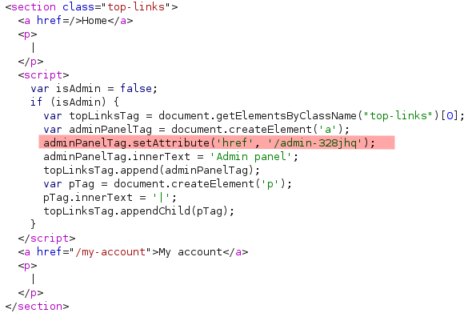
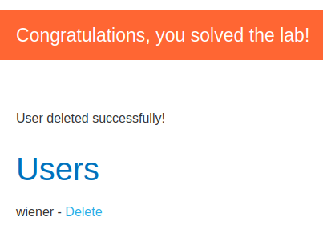

# Lab: Unprotected admin functionality with unpredictable URL

Lab-Link: <https://portswigger.net/web-security/access-control/lab-unprotected-admin-functionality-with-unpredictable-url>  
Difficulty: APPRENTICE  
Python script: [script.py](script.py)  

## Known information

- Lab contains unprotected admin panel
- URL is not predictable but is disclosed within the application
- Goals:
  - Delete user carlos

## Steps

### Analysis

As usual, the initial step is to analyse the website. This time, no robots.txt points to the correct place and the URL of the admin panel will not be found with common directory discovery methods (as already indicated in the lab title).

However, the navigation links on top use a less-than-optimal way of dynamically inserting an admin link for administrative users:

So again, this lab is as easy to solve as loading the indicated URL and clicking on 'Delete' for user `carlos`:

