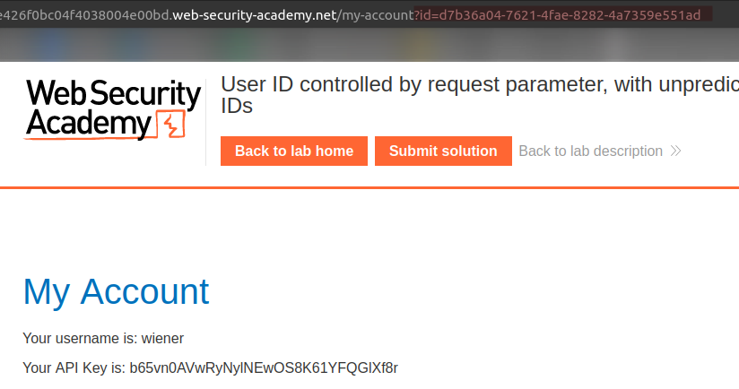
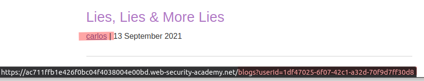
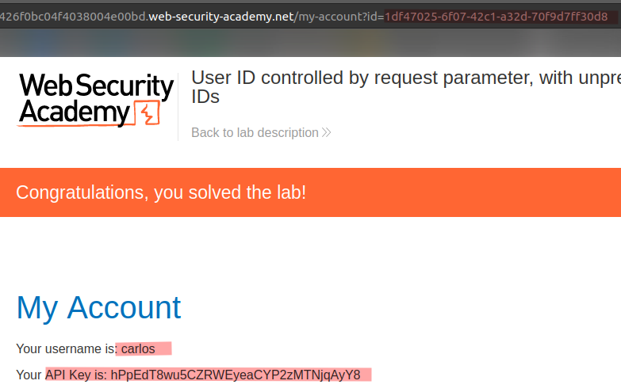

# Lab: User ID controlled by request parameter, with unpredictable user IDs

Lab-Link: <https://portswigger.net/web-security/access-control/lab-user-id-controlled-by-request-parameter-with-unpredictable-user-ids>  
Difficulty: APPRENTICE  
Python script: [script.py](script.py)  

## Known information

- Lab has horizontal privilege escalation on the user account page
- Users are identified by GUIDs
- Known credentials `wiener:peter`
- Goals:
  - Obtain GUID of `carlos`
  - Obtain and submit API key of `carlos`

## Steps

### Analysis

As usual, the first step is to analyse the page. This time, the URL-parameter `id` can not be guessed for `carlos`, as it is a GUID, which is a globally unique number (or at least should be):

So I need to find a possibility to obtain the GUID of carlos somewhere. Fortunately this is rather easy. In a blog post, the application generates a link of the author, exposing the GUID. One of the posts is of `carlos`, so I can obtain the id.

### Modify URL parameter

Like in the [last lab](../User_ID_controlled_by_request_parameter/README.md), the remaining part is easy. Accessing the account page of `carlos` and submitting the API key:

