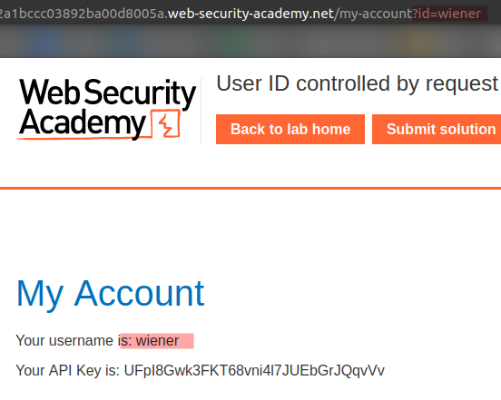
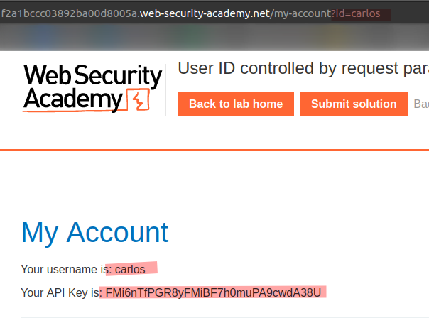
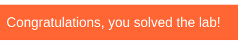

# Lab: User ID controlled by request parameter

Lab-Link: <https://portswigger.net/web-security/access-control/lab-user-id-controlled-by-request-parameter>  
Difficulty: APPRENTICE  
Python script: [script.py](script.py)  

## Known information

- Lab has horizontal privilege escalation on the user account page
- Known credentials `wiener:peter`
- Goals:
  - Obtain and submit API key of `carlos`

## Steps

### Analysis

The first step is to get familiar with the web application. I don't expect the main shop website to contain anything interesting, so I log into the account of `wiener`:

The `/my-account` page shows the API key for my account. The URL contains my account id. In an ideal world, this would not be required and the session management is done by actual sessions.

But in this case, and considering the lab is an `Apprentice` level one, I guess simply changing the URL argument will suffice.

### Change URL parameter

Sure enough, changing the id will show the information of `carlos`:

All that is left is to submit the key to solve the lab:

