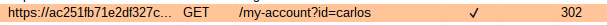
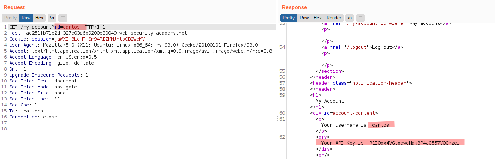
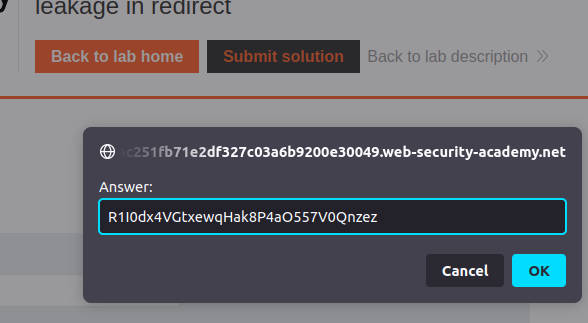

# Lab: User ID controlled by request parameter with data leakage in redirect

Lab-Link: <https://portswigger.net/web-security/access-control/lab-user-id-controlled-by-request-parameter-with-data-leakage-in-redirect>  
Difficulty: APPRENTICE  
Python script: [script.py](script.py)  

## Known information

- Lab has access control vulnerability, sensitive information leaked in a redirect response
- Known credentials `wiener:peter`
- Goals:
  - Obtain and submit API key of `carlos`

## Steps

### Analysis

As usual, the first step is to analyse the application. Here, I log into my known account and check the `/my-account` page. Like a few labs ago, the account ID is given in the URL as account name.

Trying to simply modifying the value to `carlos` leads to the login page:

However, looking at this response in more detail with Burp, it becomes evident that it is not a usual `302 Found` response with empty body, but contains the full page requested.

The browser just does not show it as it immediately redirects away to the login page. Solving the lab is now easy:

