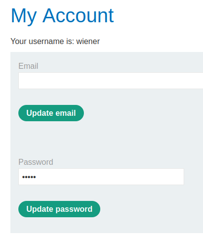
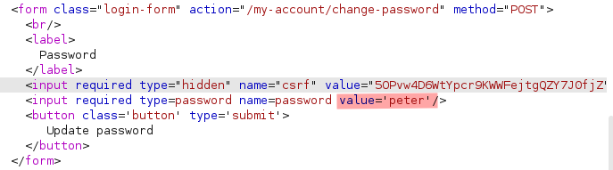
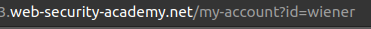
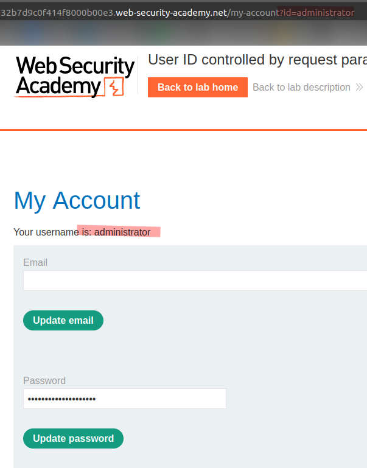
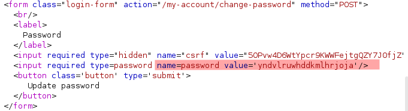
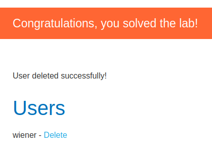

# Lab: User ID controlled by request parameter with password disclosure

Lab-Link: <https://portswigger.net/web-security/access-control/lab-user-id-controlled-by-request-parameter-with-password-disclosure>  
Difficulty: APPRENTICE  
Python script: [script.py](script.py)  

## Known information

- User account page contains current password in masked input
- Known credentials `wiener:peter`
- Goals:
  - Retrieve password of `administrator`
  - Delete user `carlos`

## Steps

### Analysis

As usual, the first step is to analyse the website. The general shop does not show anything interesting, so I login with the credentials provided and check the account page.

It shows something prefilled in the password field, the content is masked. In most cases this is done by using the input type "password". It is important to remember that this does not hide the content in any way, it just prevents it from rendering in the browser. The source of the page still contains the password in clear text:

Additionally, the URL of the account page contains the account name as argument:

### Get administrator password

Just changing the URL argument will not work if any type of sensible validation is done. Still worth checking, and as it is an apprentice lab it shows the administrator acount page:

The password can be found on the HTML source of the page:

All that is left now is log out as `wiener`, log in as `administrator` and delete user `carlos` from the Admin panel:

