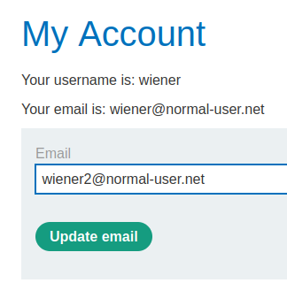
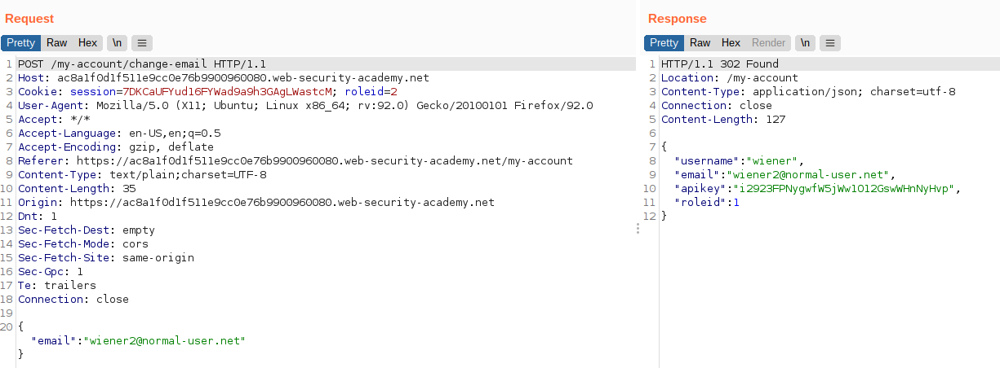
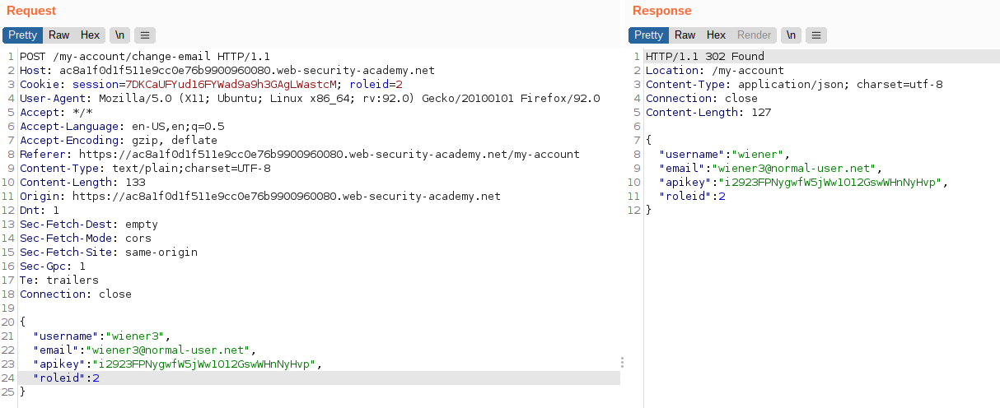
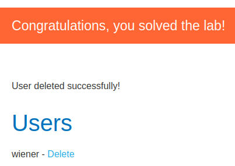

# Lab: User role can be modified in user profile

Lab-Link: <https://portswigger.net/web-security/access-control/lab-user-role-can-be-modified-in-user-profile>  
Difficulty: APPRENTICE  
Python script: [script.py](script.py)  

## Known information

- Lab contains an admin panel at `/admin`
- Admin panel is accessible only to users with roleid=2
- Known credentials `wiener:peter`
- Goals:
  - Access admin panel
  - Delete user `carlos`

## Steps

### Analysis

Like in the [last lab](../User_role_controlled_by_request_parameter/README.md), the shop page itself does not provide anything interesting.

Logging in as `wiener` provides nothing too interesting. Adding a `roleid` argument to the URL or adding a corresponding cookie does not provide access to the admin panel.

What can be done is updating the email, so I'll try it out:

The request and response does look interesting though:

The request contains the new email in json format, the response is very talkactive and echoes what looks like the complete acount data back.

### Modifying other data

I wonder if the email change functionality only sets the email, or applies any changes provided in the request. But this is easy to find out:

So the username is not applied, but the roleid is.

The only thing missing now is accessing the admin panel and delete user `carlos`:

