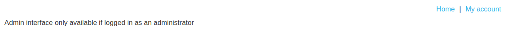
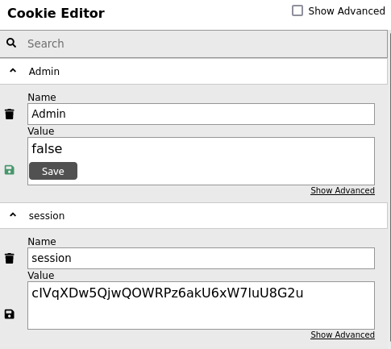
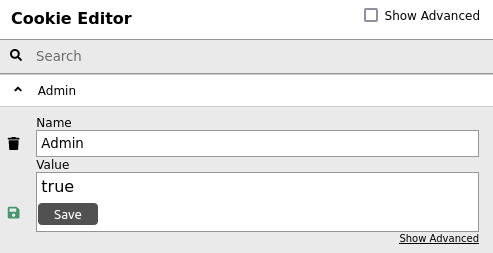
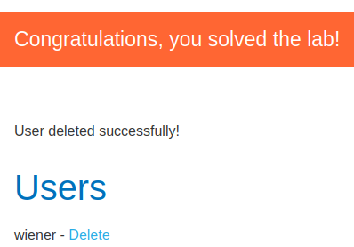

# Lab: User role controlled by request parameter

Lab-Link: <https://portswigger.net/web-security/access-control/lab-user-role-controlled-by-request-parameter>  
Difficulty: APPRENTICE  
Python script: [script.py](script.py)  

## Known information

- Lab contains an admin panel at `/admin`
- Administrators are identified by cookie
- Known good credentials `wiener:peter`
- Goals:
  - Access admin panel and delete user `carlos`

## Steps

### Analysis

As usual, the first step is analysing the web application. The general shop pages do not provide anything interesting, so I log in with the known credentials.

When trying to access the admin interface, I receive the error that only an administrator can access it:

Checking the cookies, I notice the website sets two, a session cookie and one named `Admin`

### Forging the admin cookie

Perhaps all 'forging` required is simply modifying the value to true:

Reloading the page provides the admin panel, deleting the user `carlos` and solving the lab is just a click away:

