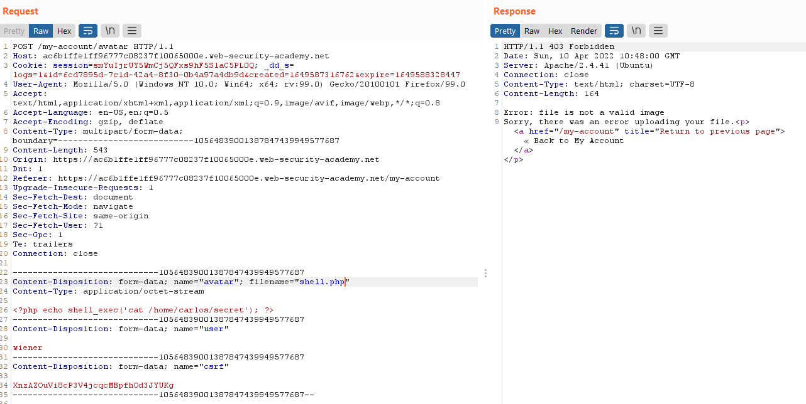
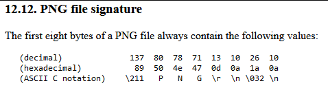
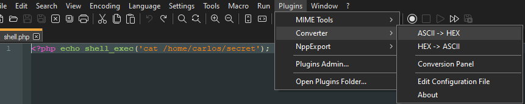
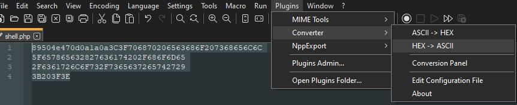
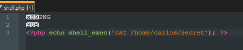
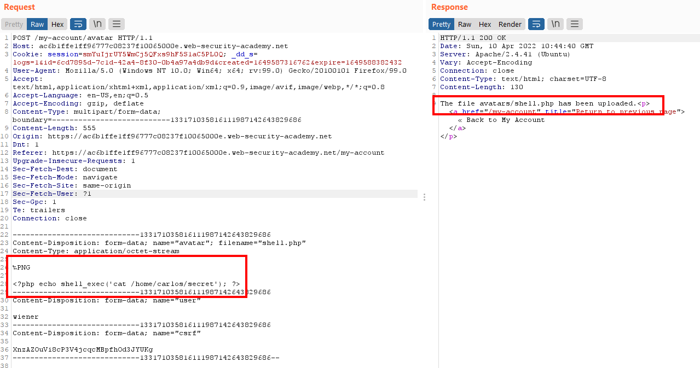
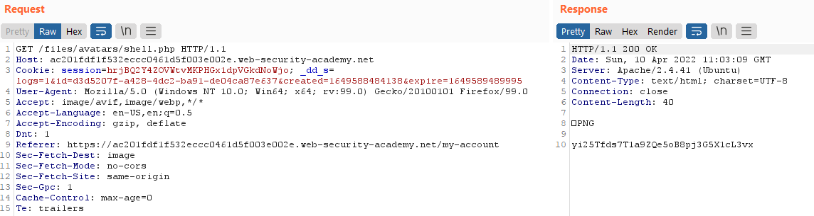

# Lab: Remote code execution via polyglot web shell upload

Lab-Link: <https://portswigger.net/web-security/file-upload/lab-file-upload-remote-code-execution-via-polyglot-web-shell-upload>  
Difficulty: PRACTITIONER  
Python script: [script.py](script.py)  

## Known information

- Applications contains vulnerable image upload
- Checks are performed to verify an uploaded file is an image
- Known good credentials: `wiener:peter`
- Goals:
  - Upload a PHP web shell
  - Exfiltrate `/home/carlos/secret` with this webshell

## Steps

As usual in this section, I am greeted by the blog application. Logging in to the account overview with the provided credentials for `wiener`, I attempt to upload a PHP file, which fails:

As expected, the solutions to previous labs fail here, so I try to fake a image file. A number of files identify themselves by starting with a fixed signature. In case of a PNG file, the details can be obtained from [libpng.org](http://www.libpng.org/pub/png/spec/1.2/PNG-Rationale.html#R.PNG-file-signature):

If the validation just checks this signature, I can bypass it by starting my file with these eight bytes.

For adding these to the file I use the Converter Plugin for Notepad++:

The signature check appears to be the only validation mechanism, as now the file can then be uploaded successfully. If the server would validate anything else with the image, for example image size, this attempt would have failed. In these cases adding the PHP code to the metadata of an actual file may be the solution (an example can be found [here](https://shouts.dev/articles/hide-payload-in-image-file-using-exiftool)).

Requesting the file contains the PNG header but it is outside of the PHP tags. Thus, it is just passed to the client and displayed as the garbage at the start of the response data:

Submitting the secret results in

