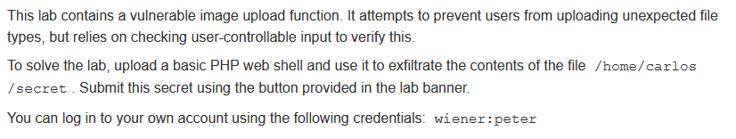
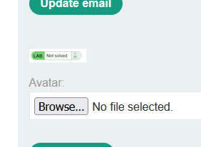
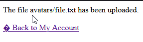
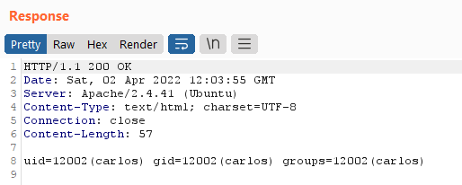
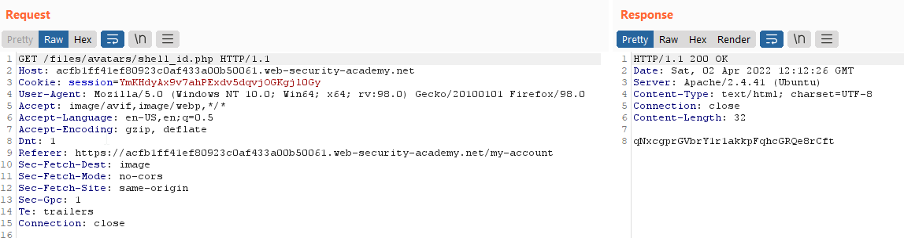
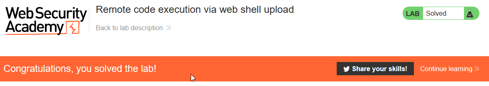

# Write-up: Remote code execution via web shell upload @ PortSwigger Academy


This write-up for the lab *Remote code execution via web shell upload* is part of my walkthrough series for [PortSwigger's Web Security Academy](https://portswigger.net/web-security).

**Learning path**: Server-side topics → File upload vulnerabilities

Lab-Link: <https://portswigger.net/web-security/file-upload/lab-file-upload-remote-code-execution-via-web-shell-upload>  
Difficulty: APPRENTICE  
Python script: [script.py](script.py)  

## Lab description



## Steps

### Analysis

The lab application is a blog website. On the public pages, nothing interesting appears obvious and I proceed to log in with the known user account of `wiener`. 

In the account settings, the user can set an email address as well as upload an avatar image:



---

### Find out what is allowed to upload

There might be a number of verification steps in place to check that the user-provided input is not malicious (ignoring the fact that the lab description says there are no validations). Common types of validations are:

- File extension
- Content-type
- Mime type
- Signature (magic numbers, usually the first few bytes of a file, e.g. png uses `89 50 4E 47 0D 0A 1A 0A`)
- File parsing/rewriting

Most of these possible validations rely on information provided by the user. Therefore they can not be used reliably to validate the input. Unfortunately, this does not stop a lot of web applications to rely on them.

As a first step, I need to find out what is allowed to upload. So try a simple text file. The application confirms the upload:



The HTML code of the page shows the URL for the (now broken) image as `/files/avatars/file.txt`. Browsing to this file shows my text file. If there are any upload restrictions in place, they are very lax. 

In an ideal world, a web application should enforce a few things:

1. Ensure no code file gets uploaded by ideally enforcing a very strict and narrow set of rules.
2. Prevent any code that might slip through and end up in the avatar directory `/files/avatars/` from being executed.

---

### Upload a web shell

Considering this is an apprentice-level lab, I try to upload a simple PHP file that calls a single shell command:

```php
<?php echo shell_exec('id'); ?>
```

The response is fairly clear, I'm allowed to execute shell commands:



So I send the original upload request into Burp Repeater and change the command to output the secret:


Calling the file will output the content of the secret file:



After submitting the information the lab updates to


