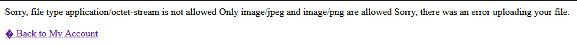
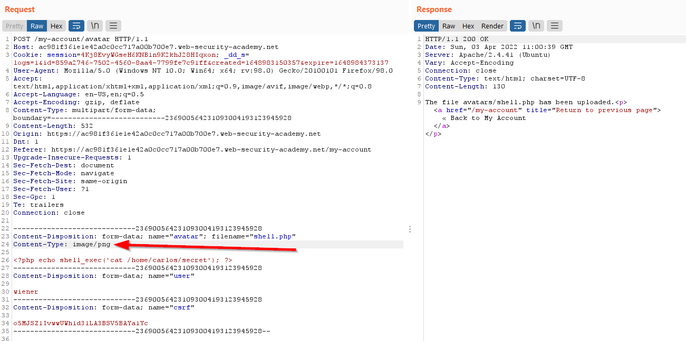
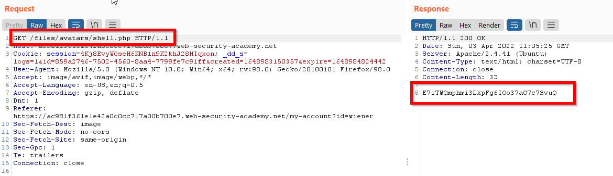
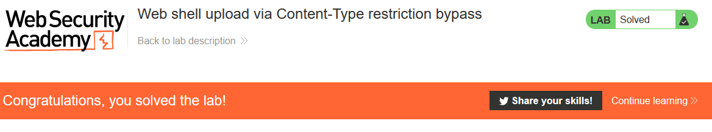

# Lab: Web shell upload via Content-Type restriction bypass

Lab-Link: <https://portswigger.net/web-security/file-upload/lab-file-upload-web-shell-upload-via-content-type-restriction-bypass>  
Difficulty: APPRENTICE  
Python script: [script.py](script.py)  

## Known information

- Applications contains vulnerable image upload
- Some validations are performed on user input files
- Known good credentials: `wiener:peter`
- Goals:
  - Upload a PHP web shell
  - Exfiltrate `/home/carlos/secret` with this webshell

## Steps

### First look

The lab application is the trusty blog system again. As it happens often, the public area shows nothing of immediate interest. Therefore I login with the known credentials of `wiener`.

In the account setting I can set both email address and avatar image for the user.

### Find out what is allowed to upload

Trying to upload the PHP script of the [previous lab](../Remote_code_execution_via_web_shell_upload/README.md) results in an error message:

However, the error message is kind enough to point in the right direction of which content types are allowed. 

### Modify content type

The next step is to modify the content type within the request to one of the allowed types. If it is the only check it will succeed. If not, the error message might again give instructions how to proceed.

So I put the upload request into Repeater, change the content type and fire. In this case the content type check appears to be the only check, as the response states 'success':

Calling the uploaded script shows the data:

Submitting the secret results in 

