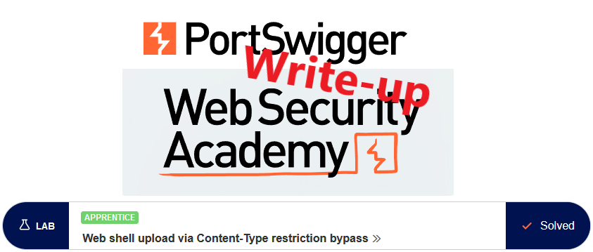
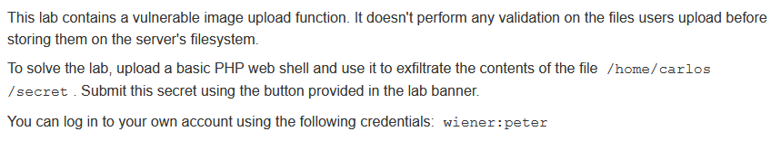

# Write-up: Web shell upload via Content-Type restriction bypass @ PortSwigger Academy

This write-up for the lab *Web shell upload via Content-Type restriction bypass* is part of my walkthrough series for [PortSwigger's Web Security Academy](https://portswigger.net/web-security).

**Learning path**: Server-side topics → File upload vulnerabilities

Lab-Link: <https://portswigger.net/web-security/file-upload/lab-file-upload-web-shell-upload-via-content-type-restriction-bypass>  
Difficulty: APPRENTICE  
Python script: [script.py](script.py)  

## Lab description

## Steps

### First look

The lab application is a blog website. On the public pages, nothing interesting appears obvious and I proceed to log in with the known user account of `wiener`. 

In the account settings, I can set both an email address and an avatar image for the user.

---

### Find out what is allowed to upload

First I try to upload the PHP script of the [previous lab](../Remote_code_execution_via_web_shell_upload/README.md). This time, some upload restrictions are in place and I receive an error message:

However, the error message is kind enough to point out some details

1. The first check that fails verifies the Content-type, which is a user-provided value.
2. It shows the values for Content-Type that are permitted.

---

### Modify content type

The next step is to modify the content type within the request to one of the allowed types.

If this is the only check that is performed, I will succeed. If not, the error message might again give instructions on how to proceed.

I load the upload request into Repeater and change the content type.

The response indicates success. This means the content-type verification is the only check that is performed by the application:

The file name remained as `shell.php` so that the server can execute it. Calling the uploaded script shows the secret data:

After submitting the secret, the lab updates to

