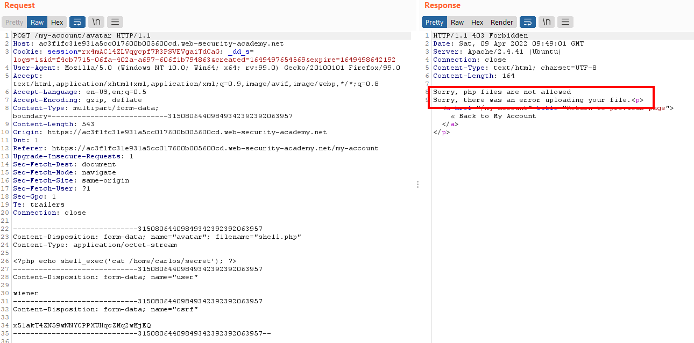
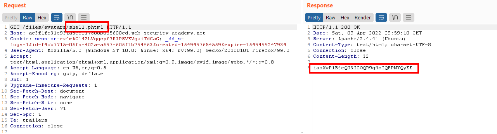
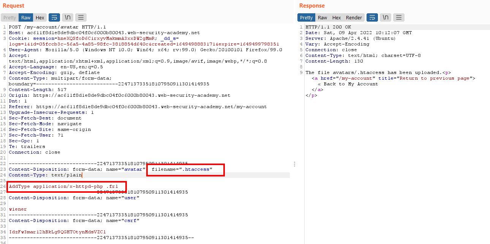
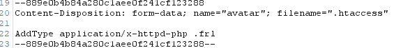
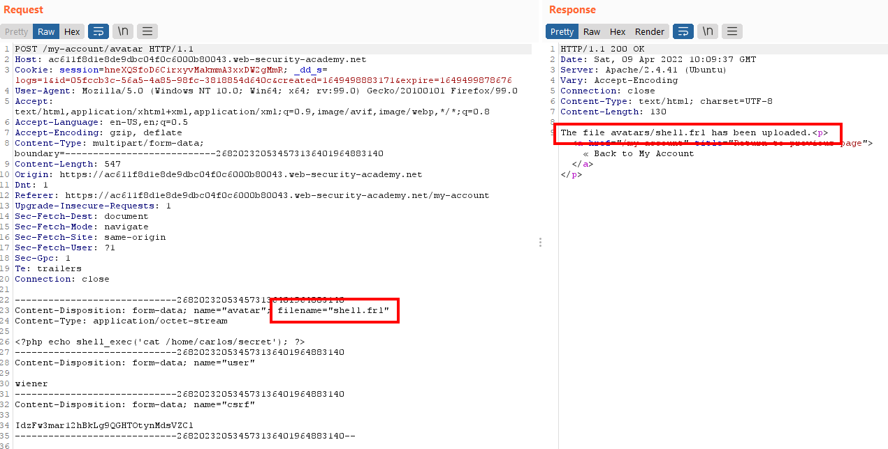
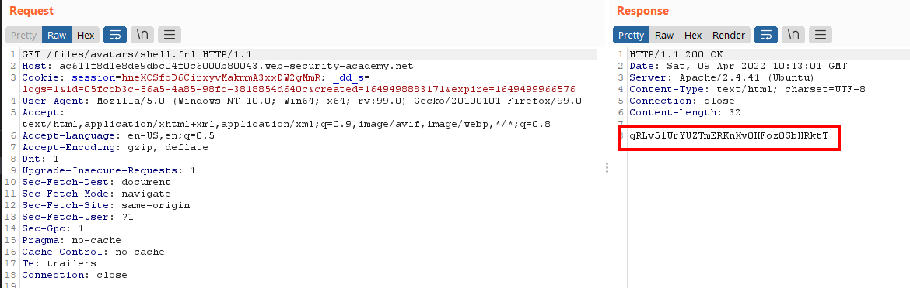

# Lab: Web shell upload via extension blacklist bypass

Lab-Link: <https://portswigger.net/web-security/file-upload/lab-file-upload-web-shell-upload-via-extension-blacklist-bypass>  
Difficulty: PRACTITIONER  
Python script: [script.py](script.py)  

## Known information

- Applications contains vulnerable image upload
- No execution of user-supplied files
- Known good credentials: `wiener:peter`
- Goals:
  - Upload a PHP web shell
  - Exfiltrate `/home/carlos/secret` with this webshell

## Steps

### Analysis

Loading the web application shows the usual blog system. The public pages show nothing of interest, so I login with the known credentials of `wiener`.

Trying to upload the php script of previous labs shows that PHP files are not allowed to upload:

No file with a PHP extension can be uploaded on the server. Attempts to circumvent this with different capitalization `shell.pHP` or null bytes in the filename `shell.php%00.png` showed no success.

### Solution 1 (the easy and unintended way)

The next step was to try less common alternative extensions for PHP files. The [Hacker's Grimoire](https://vulp3cula.gitbook.io/hackers-grimoire/exploitation/web-application/file-upload-bypass) list a couple of such alternatives for PHP: `phtml, .php, .php3, .php4, .php5`

While the extensions with numbers at the end uploaded successful, they were not executed by the server. Uploading and accessing the file as `.phtml` is a different story and executes the script:

What caused me to stop was noticing the Hint in the lab description: `You need to upload two different files to solve this lab.`

Reading through the academy content for this lab made me realize that I took a unintended shortcut with my solution, so continue with the proper path.

### Solution 2 (the intended way)

I already noticed in my first solution that I was able to upload a number of different file extension, possibly even arbitrary ones.

The application is served by an apache server, so I try uploading a custom .htaccess file that maps the `.frl` extension to PHP. If reusing an upload request of `png` or `php` files for the Repeater it is important to set the Content-Type to `text/plain`. Otherwise, the server will return a `500 Internal Server error` when trying to load something later on.

On writing the script for this lab I learned that the `Content-Type` can be omitted completely, the following is enough:

I rename the script of the [previous lab](../Web_shell_upload_via_path_traversal/README.md) to `shell.frl` and upload it:

Calling this file executes the PHP code and shows the secret string:

Submitting this solution results in

