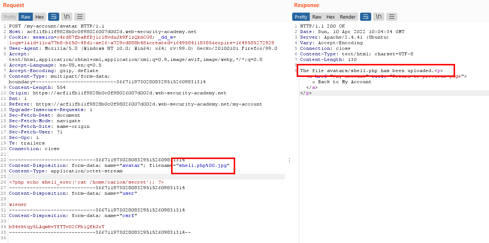
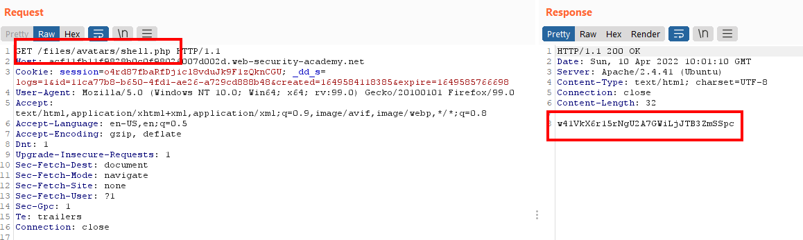
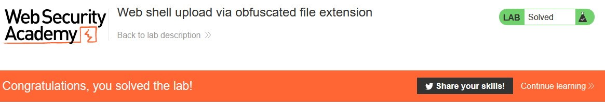

# Lab: Web shell upload via obfuscated file extension

Lab-Link: <https://portswigger.net/web-security/file-upload/lab-file-upload-web-shell-upload-via-obfuscated-file-extension>  
Difficulty: PRACTITIONER  
Python script: [script.py](script.py)  

## Known information

- Applications contains vulnerable image upload
- Uses blacklists for file extensions
- Known good credentials: `wiener:peter`
- Goals:
  - Upload a PHP web shell
  - Exfiltrate `/home/carlos/secret` with this webshell

## Steps

### Analysis

As usual in this section of the lab, the application is the block system. The public pages are of no interest, so I go straight to the account page using the provided credentials of `wiener`.

Trying to upload a PHP script as avatar image leads to an error message telling me only some image files are allowed to upload: 
`Sorry, only JPG & PNG files are allowed Sorry, there was an error uploading your file.`

Loading the upload request into Repeater I can quickly experiment with multiple extension. 

Some attempts fail to upload or upload as images, including:

- double file extension (`shell.jpg.php`, `shell.php.jpg`)
- Bypass non recursive filtering (`shell.ph.phpp`)
- trying to split the command (`.php;.jpg`)

However, attempting to terminate the filename early with a null-byte (`shell.php%00.jpg`) proves successful:

The PHP filter that blocks all non-images sees the filename as having a `.jpg` extension. When the file is being written on an operating system level, the `%00` essentially terminates the string and causes the OS to see the file name as `shell.php`.

A small detour:

This behaviour is due to the fact that the C programming language does not have a dedicated structure to store strings but uses an array of characters. This array is of arbitrary length, the end of the string is defined by a null byte (`0x00` or `%00`). 

If there is none present and the application does not protect against this, than it will read until it reaches the limit of its assigned memory and crashes. 

While in C++ one can write code that does not exhibit this behaviour it is often effected as well due to being backwards compatible with C.

If someone, in this case me, introduces a null byte within a string, the file system operations performed by the operating system will treat this null byte as the definite end of the string, no questions asked.

Languages like PHP do not treat the null byte any different than any other bytes in the string. As such, the extension check in PHP sees the file as `shell.php%00.jpg`, validates the correct file extension and hands it over to the operating system to perform its part (i.e. actually writing the file).

The operating system gets the filename `shell.php%00<some_garbage>`, correctly ignores everything from the null byte onwards and writes the file `shell.php` as instructed.

Now back on track.

The file I just uploaded I can now call to read the secret:

Submitting it results in 

