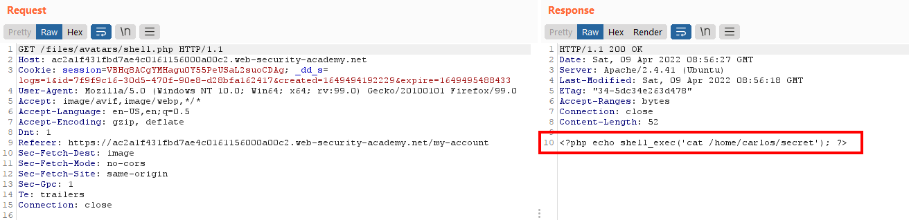
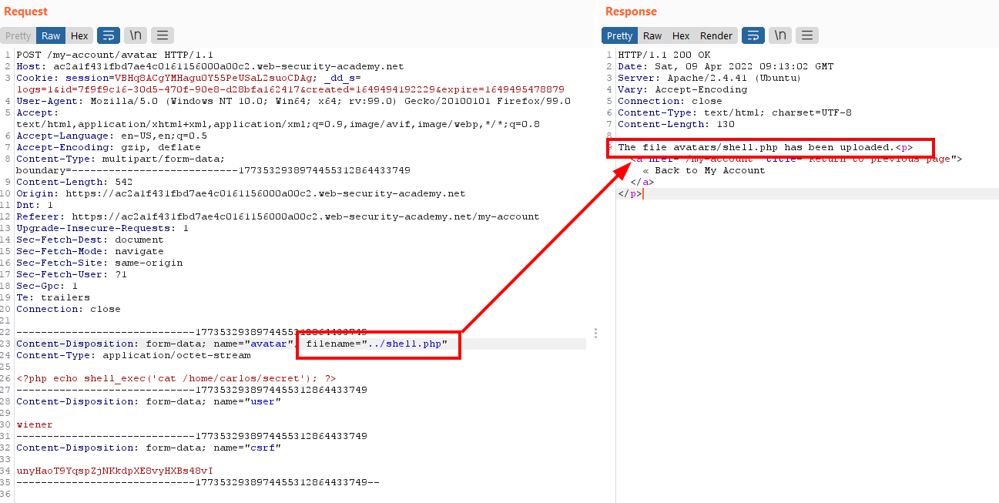
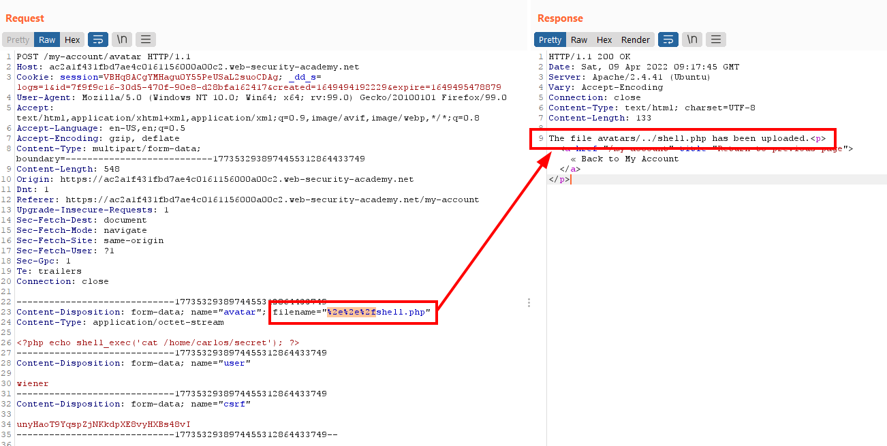
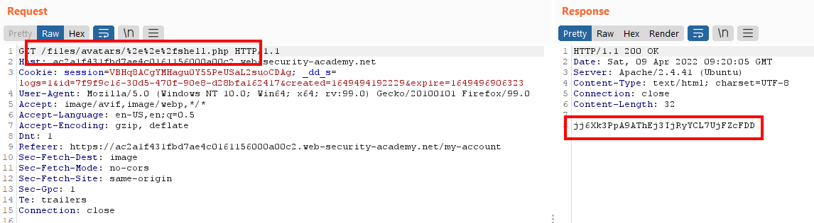
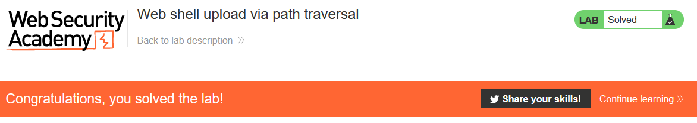

# Lab: Web shell upload via path traversal

Lab-Link: <https://portswigger.net/web-security/file-upload/lab-file-upload-web-shell-upload-via-path-traversal>  
Difficulty: PRACTITIONER  
Python script: [script.py](script.py)  

## Known information

- Applications contains vulnerable image upload
- No execution of user-supplied files
- Known good credentials: `wiener:peter`
- Goals:
  - Upload a PHP web shell
  - Exfiltrate `/home/carlos/secret` with this webshell

## Steps

### Analysis

As with the earlier labs in this section, the blog system is used as lab application. The public pages do not show anything of interest, so I login with the provided credentials for `wiener`.

The account overview allows an upload of the avatar image. A disguise of the file content is not necessary here. Uploading the php file from the [previous lab](../Web_shell_upload_via_Content-Type_restriction_bypass/README.md) is successful. However, accessing this file just shows the content of the file. The PHP code is not executed on the server side:

Let's load the file upload request into Repeater to play around with it.

### Modify the file path

The definition of what files are executed is often done per directory. The `/files/avatar/` path appears not to execute PHP scripts. The next step is to try and escape the path into a location that executes PHP.

I change the filename to `../shell.php` to try to store the file on dictionary up. The upload confirmation shows the same path `avatar/` as the previous upload, so the path traversal did not succeed:

Either some or all of the characters of the path traversal are stripped away, or the application is not vulnerable to this type of attack (the lab name gives a hint which one it is).

My first attempt to circumvent the protection is to obfuscate the path traversal with URL-encoding the `../` part:

The response indicates that the path traversal was successful. Accessing the path calls the file outside of the avatar directory and executes the PHP on the server, providing the secret string (calling `/files/shell.php` shows the same, I just went via the account details page where the image source contains the URL-encoding). 

Submitting the secret results in

