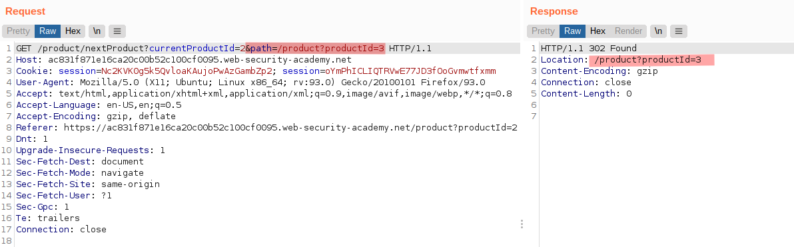
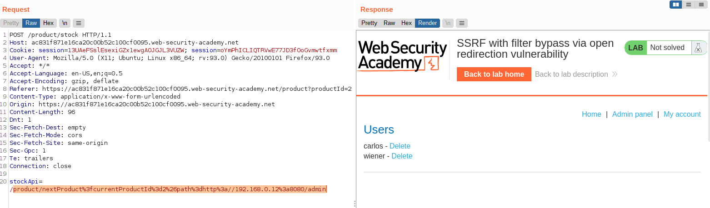
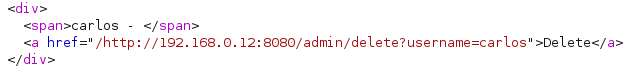
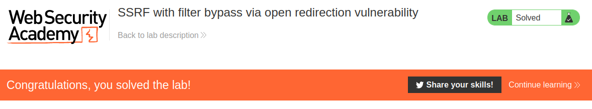

# Lab: SSRF with filter bypass via open redirection vulnerability

Lab-Link: <https://portswigger.net/web-security/ssrf/lab-ssrf-filter-bypass-via-open-redirection>  
Difficulty: PRACTITIONER  
Python script: [script.py](script.py)  

## Known information

- Application has a stock checking feature that gets data from an internal system
- Admin interface is at `http://192.168.0.12:8080/admin`
- Stock checker only accesses the local application
- Abuse requires an open redirect in the application
- Goals:
  - Access the admin panel and delete user `carlos`

## Steps

### Analysis

The first step is to analyse the application, specifically the stock checking functionality. Most functionality is similar to the previous labs. However, the stock check feature does not use full URLs this time but absolute paths within the local web root.

As expected, attempting to use the external URL of the admin interface does not work this time:

Attempting to use different ways to represent this URL will likely fail as well, in a real scenario this would need to be verified.

What is noticable immediately is a new feature in the product display, linking the next product. What is interesting is that this link contains a path as URL argument, and results in a `302 Found` redirect to that path.

### Analyse redirect

Changing the link to any other page that is not the 'next' product according to whatever rule defines 'next' works as well.

This confirms that it is an redirect that is not limited to the `/product` path. Does it work with redirects at a completely different server?

Yes, it appears to be an open redirect, using any URL provided as the redirect location.

### Modify product stock checker

Now I have a local path that will redirect to any URL I provide. If the stock checker does not perform any validation on the argument, I can combine these to access any arbitrary system. While Burp usually does the required URLencoding automatically, here it is required to do it manually, otherwise the `&path` of the payload will create a second parameter instead of being part of the value of the first one:

The admin interface shows the link required to delete the user:

Simply copy and paste the link to the stockApi immediately confirms that the lab is solved:

And of course, at the same time the lab page updates to

