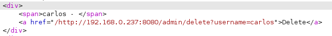
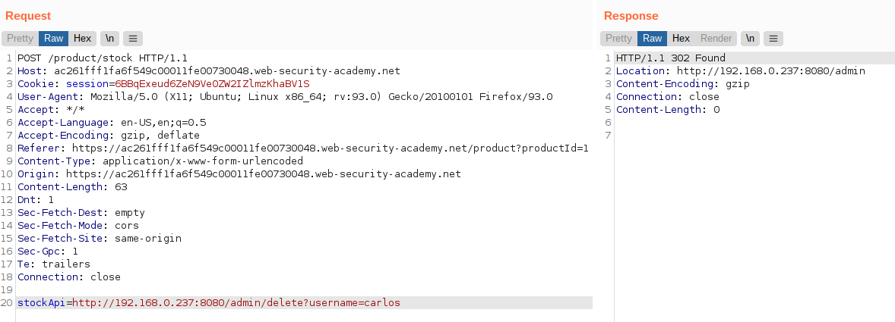

# Lab: Basic SSRF against another back-end system

Lab-Link: <https://portswigger.net/web-security/ssrf/lab-basic-ssrf-against-backend-system>  
Difficulty: APPRENTICE  
Python script: [script.py](script.py)  

## Known information

- Application has a stock check feature that gets data from an internal system
- Admin interface is within range `192.168.0.X` on port 8080
- Goals:
  - Access admin panel and delete user `carlos`

## Steps

### Analysis

As usual, the first step is to analyse the application. As no credentials are provided, only the public pages can be assessed.

As in the [previous lab](../Basic_SSRF_against_the_local_server/README.md), the stock check API uses URLs that are provided by the client and can be changed at will:

Using the same IP, no admin interface is found on either `/admin` or an empty path. So I attempt to find the system with Burp Intruder

### Find IP

- Attack type: **Sniper**
- Payload: Numbers, 1...254, Step 1

The result shows a single `200 OK` response, which is the IP of the admin interface. In the source, the link to delete user `carlos` is visible:

### Delete carlos

Now just send the request to Burp Repeater and copy the link to delete user `carlos`:

At the same time, the lab updates in the browser:

