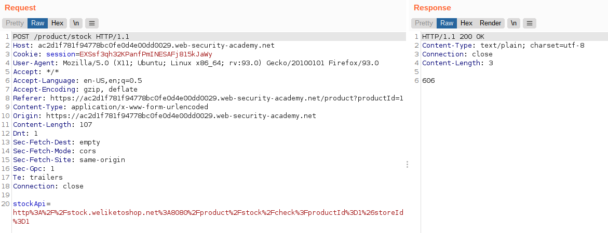
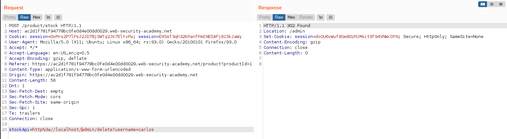
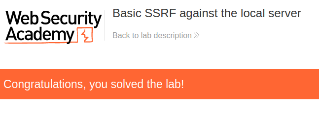

# Lab: Basic SSRF against the local server

Lab-Link: <https://portswigger.net/web-security/ssrf/lab-basic-ssrf-against-localhost>  
Difficulty: APPRENTICE  
Python script: [script.py](script.py)  

## Known information

- Application uses backend system to check stock availability
- Admin panel is available at `http://localhost/admin`
- Goals:
  - Access the admin panel and delete user `carlos`

## Steps

### Analyse

As usual, the first step is to analyse the web application, in this case our trusted store website again. It now offers the option to check the stock amount of a product for multiple stores:

As no credentials are provided this time, the public page is all that is available right now, so I have a look at the corresponding communication in Burp.

On submit, the form is intercepted by some JavaScript, which executes the request and inserts the result into the DOM of the page.

What is even more interesting is that the shop selection contains explicit URLs that are used as POST argument by the javascript:

### Intercept call and modify URL

So I modify the store check URL to retrieve the admin panel:

It is not possible to click on the delete link for user `carlos`, as the backend does some authorization and refuses. I guess it also only allows localhost access. It can be seen that the URL is to delete user `carlos` is also im `/admin`:

To make it easier send the POST to `/product/stock` to Repeater and verify that we reach the admin panel there:

Now I simply change the URL to the delete URL found in the HTML

At that moment, the browser updates to:

