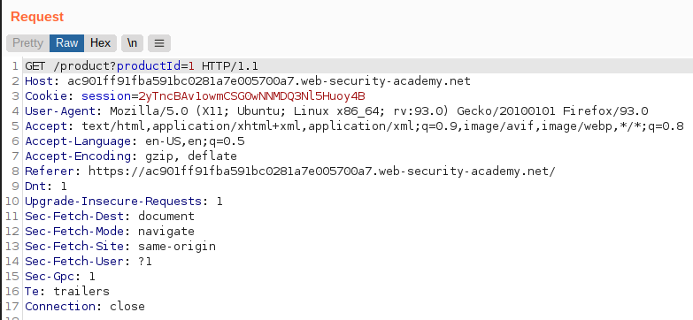
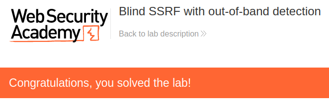

# Lab: Blind SSRF with out-of-band detection

Lab-Link: <https://portswigger.net/web-security/ssrf/blind/lab-out-of-band-detection>  
Difficulty: PRACTITIONER  
Python script: No script available

## Known information

- Website uses analystics software that fetches a URL specified in the referer header
- Goals:
  - Cause a HTTP request to Burp Collaborator

## Steps

### Analysis & Solution

As usual, the first step is to check out the target website, in this case the well known shop website. While browsing, all requests contain a referer header which indicates the page that contained the link used:

On the main page this referer header does not do anything noticable. But when sending a product page to Repeater and updating the header to the Burp Collaborator URL (in main menu `Burp -> Burp Collaborator Client`), this behaves different:

After sending this request, the Burp Collaborator Client shows DNS and HTTP traffic from the lab, confirming that the server was coaxed to contact the provided external domain:

At the same time, the lab page updates to

