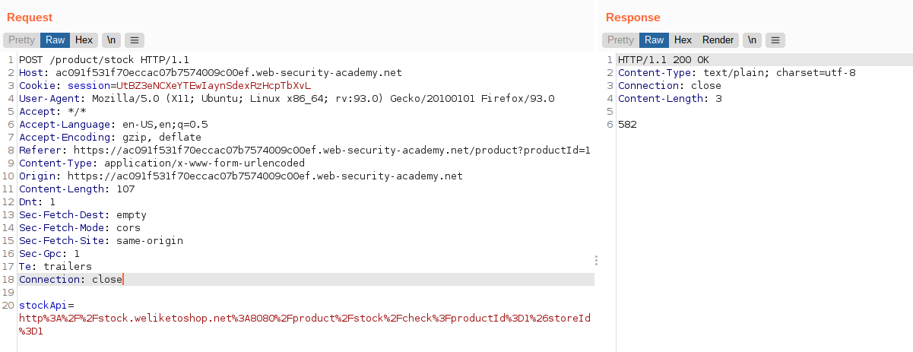
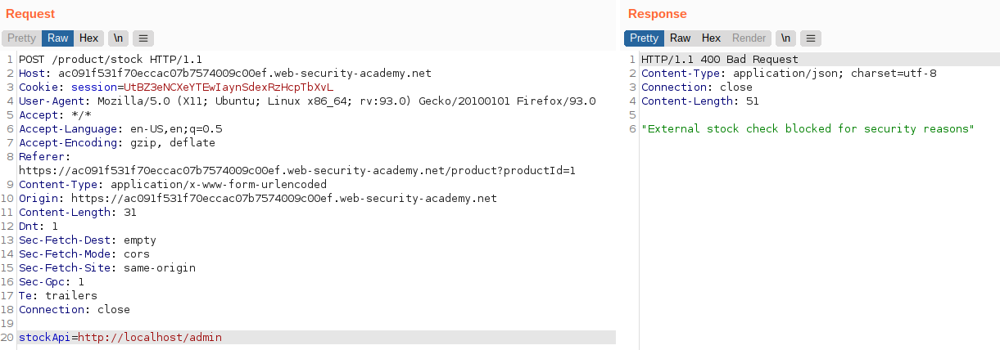
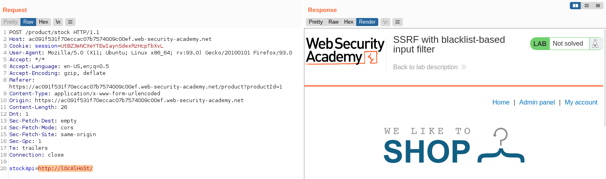
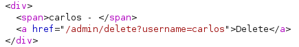
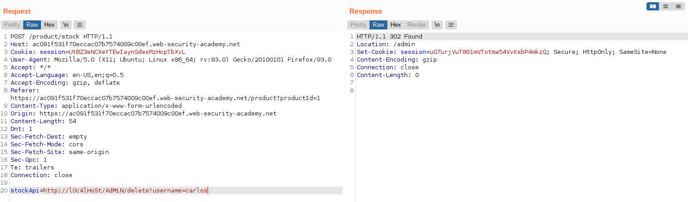
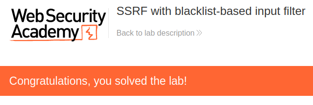

# Lab: SSRF with blacklist-based input filter

Lab-Link: <https://portswigger.net/web-security/ssrf/lab-ssrf-with-blacklist-filter>  
Difficulty: PRACTITIONER  
Python script: [script.py](script.py)  

## Known information

- Application checks stock availability on an internal system
- Admin interface is available on `http://localhost/admin`
- Two anti-SSRF features are implemented
- Goals:
  - Access the admin panel and delete user `carlos`

## Steps

### Analysis

The shop is again the known shop website. We do not have any credentials this time, so the initial analysis is restricted to the public pages.

As in the [previous lab](../Basic_SSRF_against_the_local_server/README.md), the stock check API uses URLs that are provided by the client and can be changed at will:

This time, some basic security measures are in place. Simply requesting the admin interface is denied by the application:

### Find blocked values

Next is to find out what exactly is blocked, is it the `localhost`, the `/admin` or a combination thereof.

Using a stock api of `http://localhost/` results in the same error as above. However, using `http://lOcAlHoSt/`, the result is different:

Note the link "Admin panel" in the response. The web server recognizes the page as local and embeds the admin link. Using straight `/admin` gets blocked again, using the same capitalization approach is successful:

### Issuing the request

In the source, the correct URL to delete a user is found:

Therefore the request to delete user `carlos` is `http://lOcAlHoSt/AdMiN/delete?username=carlos`

At the same time, the page in the browser updates to

### Alternatives

There are alternative ways to represent the path for getting to the admin panel.

#### Accessing localhost

##### Long IP values

The value of 127.0.0.1 is a shortened value. Leading zeros can be omitted. Using the full versin of `http://127.000.000.001/AdMiN` is enough to access the admin panel. (or any other combination of zeros, e.g. `http://127.0.0.01/AdMiN`)

When doing this it is important to remember that, depending on the application, leading zeros may be evaluated as octal values. In this example it makes no difference, but any IP octed greater than 7 might be interpreted differently.

##### Short IP values

As mentioned, leading zeros can be omitted in an IP. This includes the single zeros in 127.0.0.1. If a octed is empty, the point must be omitted as well. Therefore both `http://127.1/AdMiN` and `http://127.0.1/AdMiN` are valid ways of accessing the admin panel.

##### Using decimal, octal or hex values

My next attempt is using the IP of 127.0.0.1 and alternative forms of its representations. For getting the alternative versions, using an [online calculator](https://ipaddress.standingtech.com/online-ip-address-converter) is helpful:

The following addresses are all valid ways for accessing the admin panel:

- `http://2130706433/aDmin`
- `http://0x7f000001/aDmin` (prefix hex values with `0x`)
- `http://017700000001/aDmin` (prefix octal values with `0`)

#### Accessing the directory

##### URL encoding the directory

As an alternative to the capitalization of the `admin` used above, it can be URL-encoded twice. So the path `http://127.0.1/%25%36%31%25%36%34%25%36%64%25%36%39%25%36%65` also reaches the admin panel.

Doing the encoding once is not enough as it will be resolved by the web server receiving the request before handing it to the application. Doing it twice, the application receives `/%61%64%6d%69%6e` for the path which does not match the blocked `/admin`. The backend server then decodes it into the desired path.
