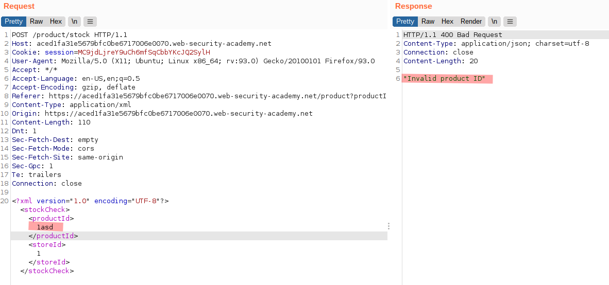
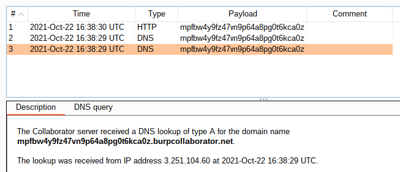
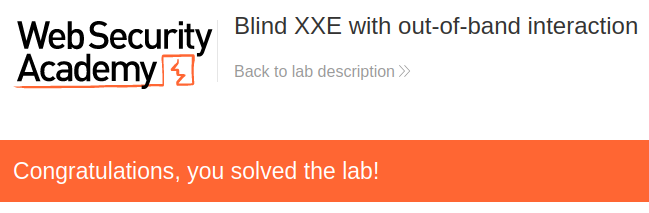

# Lab: Blind XXE with out-of-band interaction

Lab-Link: <https://portswigger.net/web-security/xxe/blind/lab-xxe-with-out-of-band-interaction>  
Difficulty: PRACTITIONER  
Python script: No script available  
Burp Suite Professional is required to solve this lab!

## Known information

- Lab applications has a stock checking feature that is vulnerable to XXE
- Result of XEE is not displayed back
- Goals:
  - Perform a DNS lookup to Burp Collaborator

## Steps

### Analysis

The application is again the shop website containing the stock check feature. At the first glance, the request and response looks similar to the previous labs:

However, the difference becomes evident when an invalid productId is used. This time, the (resulting) value of productId is not echoed back in the response:

This prevents any exfiltration of information in the response directly.

### Exploitation

If the XML is not validated properly on the server side and the application is still vulnerable to XXE, than I can use another channel as my way of receiving feedback. In this case, a simple HTTP request will suffice:

The invalid product ID response can be prevented by inventing a new tag and embedding the XXE there. This will prevent a `400 Bad Request` error to appear in any log but is much less likely to succeed in case a schema validation occurs:

In both cases, after sending the request and polling the Burp Collaborator client, a few hits are shown:

At the same time, the lab updates to

