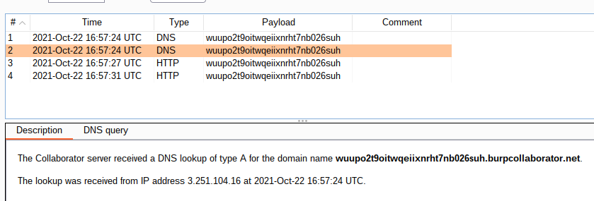

# Lab: Blind XXE with out-of-band interaction via XML parameter entities

Lab-Link: <https://portswigger.net/web-security/xxe/blind/lab-xxe-with-out-of-band-interaction-using-parameter-entities>  
Difficulty: PRACTITIONER  
Python script: No script available  
Burp Suite Professional is required to solve this lab!

## Known information

- Lab applications has a stock checking feature that is vulnerable to XXE
- Result of XEE is not displayed back
- Application blocks some types of XXE
- Goals:
  - Perform a DNS lookup and HTTP request to Burp Collaborator

## Steps

### Analysis

This lab is again the shop website containing the stock checking feature. Like in the [previous lab](../Blind_XXE_with_out-of-band_interaction/README.md), no part of the input is included in the response, preventing any direct abuse or even detection of the XXE.

Using a normal entity declaration and using it within the document is blocked by the application. However, using parameter entities and 'reusing' them within the DTD is allowed.

### Exploitation

As such, I declare and use a parameter entity that causes a request to my Burp Collaborator instance:

In the Burp Collaborator client, a few hits will be shown:

At that moment, the lab application updates to

