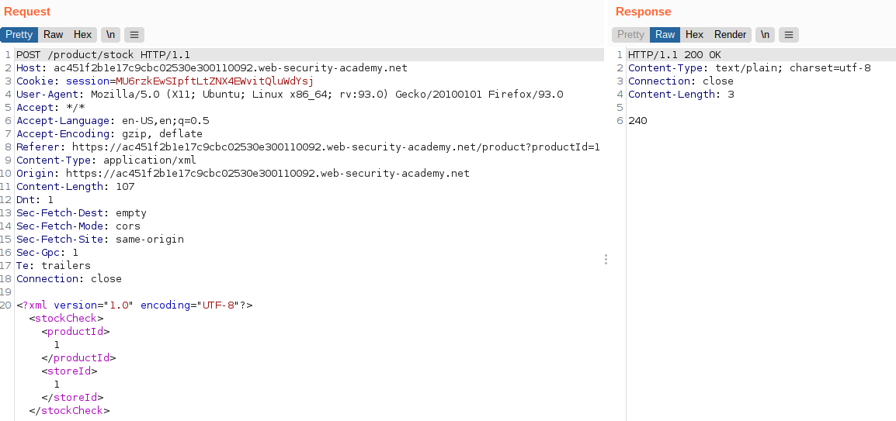
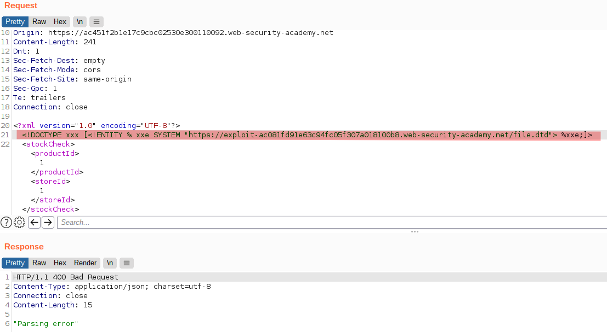

# Lab: Exploiting blind XXE to exfiltrate data using a malicious external DTD

Lab-Link: <https://portswigger.net/web-security/xxe/blind/lab-xxe-with-out-of-band-exfiltration>  
Difficulty: PRACTITIONER  
Python script: [script.py](script.py)  
Note: The lab can be solved by using Burp Collaborator or a provided exploit server. For the Burp Collaborator way, Burp Suite Professional is required!

## Known information

- Lab applications has a stock checking feature that is vulnerable to XXE
- Result of XEE is not displayed back
- Goals:
  - Exfiltrate the content of `/etc/hostname` via Burp Collaborator or the provided exploit server

## Steps

### Analysis

On loading of the web application (the shop website again) I can see that I have an exploit server available, allowing me to host a single file.

This is expected as the academy text already indicates that an external DTD will be used to exploit this lab.

The product check request looks similar to the earlier labs, containing all data required as XML:

### Exploit

To exploit the XXE vulnerability, I prepare a DTD file on the exploit server from academy content:

Note that the dynamic portion has the `%` encodedI then send the store check request to Burp Repeater and add the reference to the external DTD file:

The response is a `400 Bad Request` but that is not unexpected, after all the application performed a data flow that was never intended.

After sending the malicious request, these requests are logged on the exploit server:

The first one is the application actually loading my malicious DTD file, the second is the exfiltration of the hostname.

Submitting the solution results in

