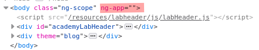

# Lab: DOM XSS in AngularJS expression with angle brackets and double quotes HTML-encoded

Lab-Link: <https://portswigger.net/web-security/cross-site-scripting/dom-based/lab-angularjs-expression>  
Difficulty: PRACTITIONER  
Python script: [script.py](script.py)  

## Known information

- Lab application contains a DOM-XSS vulnerability in the search feature using AngularJS expressions
- Goals:
  - Raise an `alert` box using AngularJS expressions

## Steps

This lab mentions AngularJS expressions. I never used it before so a quick google search leads to the [respective documentaion](https://docs.angularjs.org/guide/expression) on the angular website.

AngularJS expressions are executed in HTML sections inside of nodes containing the`ng-app` attribute. Fortunately, the full HTML body of the page is set as valid scope:

The most trivial example given at the documentation linked above is a simple addition with `{{1+2}}`. So using `foobar{{1+2}}` as search term, the search term is displayed as:

This confirms the execution of the expression. The next step is to find a possibility to inject script code. After another quick google search I found my way back to [PortSwigger](https://portswigger.net/research/xss-without-html-client-side-template-injection-with-angularjs), explaining some of the security and sanitization of angular.

This page also contains example payloads that can be used to inject Javascript into Angular. Using `{{constructor.constructor('alert(document.domain)')()}}` as search string shows the desired alert box, confirming the XSS vulnerability for the domain, and the lab updates to

Even more payload examples can be found on the pages linked on PortSwigger and on [PayloadsAllTheThings](https://github.com/swisskyrepo/PayloadsAllTheThings/blob/master/XSS%20Injection/XSS%20in%20Angular.md). While taking payloads from such lists clearly shows that I lack the experience to find these things myself it provides useful starting points, backgrounds and explanations (like the PortSwigger article above) to enable me to learn about things I have never seen before.
