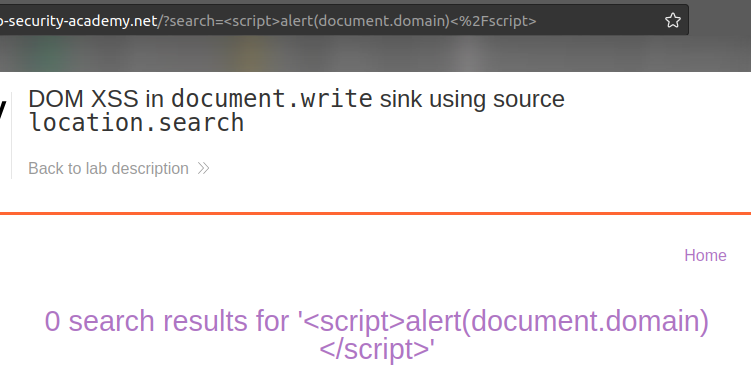
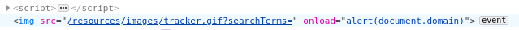

# Lab: DOM XSS in document.write sink using source location.search

Lab-Link: <https://portswigger.net/web-security/cross-site-scripting/dom-based/lab-document-write-sink>  
Difficulty: APPRENTICE  
Python script: [script.py](script.py)  

## Known information

- Application contains a DOM-XSS vulnerability in the search query tracking using `document.write`
- Content of write is taken from URL
- Goals:
  - Perform a XSS and call `alert`

## Steps

The lab application is the blog website, again with the search functionality. The search term is included in the result page. This time, however, doing a simple XSS attempt fails:

Looking at the page source, the search term displayed is properly encoded. However, it also shows that a javascript takes the search term out of the URL and writes it into an img-tag:

Using the browser tools, I can inspect the resulting HTML. It is visible that my search term is embedded without any apparent safeguards:

Of course, the script tags are within a string here, so they are harmless. However, if I am able to terminate the string by injecting double quotes, than I can manipulate the resulting HTML freely:

This results in the following HTML:

It is visible that I closed both the src-string and the img-tag, followed by valid JavaScript triggering the alert-box. The remaining `">` of the original content is shown as plain text, but this does not interfere here.

At the same moment, the lab updates to

The same result can be achieved by injecting `" onload="alert(document.domain)`, which uses the `">` from the original content results in this HTML:

