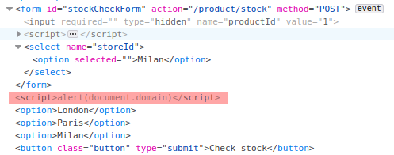

# Lab: DOM XSS in document.write sink using source location.search inside a select element

Lab-Link: <https://portswigger.net/web-security/cross-site-scripting/dom-based/lab-document-write-sink-inside-select-element>  
Difficulty: PRACTITIONER  
Python script: [script.py](script.py)  

## Known information

- Applications has a DOM-based XSS vulnerability in the stock check feature.
- `document.write` is used with user controlled data (`location.search`) within a `select` element.
- Goals:
  - Break out of the select and raise an `alert` box.

## Steps

### Analysis

The lab application is again the shop website containing the stock check feature. This time, the selection box for it is created dynamically by client side JavaScript. The defining feature that requires this is that if a store ID is provided in the URL, the store is pre-selected. For example, adding `&storeId=Milan` to the URL will put Milan in first place of the list and selects it:

This is done by this script, which does not perform any validation on the argument.

The resulting HTML looks like this:

### Exploitation

Unfortunately, I can not directly add some JavaScript in the text of the option tag. But I can complete the tags and put script content outside of the scope of the option.

Adding `&storeId=Milan</option></select></form>Whatever` to the URL results in this HTML:

The location of the `Whatever` is just a right spot for adding a script. Modifying the URL to use `&storeId=Milan</option></select></form>` results in this HTML:

This raises the alert box and the lab updates to

