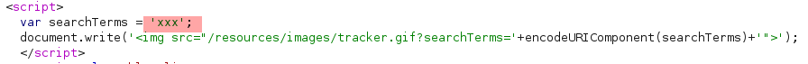

# Lab: Reflected XSS into a JavaScript string with angle brackets HTML encoded

Lab-Link: <https://portswigger.net/web-security/cross-site-scripting/contexts/lab-javascript-string-angle-brackets-html-encoded>  
Difficulty: APPRENTICE  
Python script: [script.py](script.py)  

## Known information

- Application contains a reflected XSS vulnerability in the search query tracking feature
- Goals:
  - Raise an `alert` by breaking out of the JavaScript string

## Steps

### Locate possible injection points

As usual the first step is to analyse the application and the vulnerable feature. Searching for a term result in this HTML code that embeds the term within the document:

To improve handling I send this request to Burp Repeater.

### Find non-escaped characters

Next step is to find out if there is an interesting character that does not get escaped by the server. For this, I use `xX';!--"<XSS>=&{()}Xx` as payload (urlencode!). The response contains this interesting code:

It shows that the quote terminates the string. On the HTML side only the angle brackets get HTML-encoded.

### Exploit

I can use this to inject any arbitrary JavaScript as long as it does not contain angle brackets. TMy first attempt is to terminate the string and command, call the alert and comment out anything that follows with `;alert(document.domain);//`, which results in this valid JavaScript code:

Repeating the search in the browser shows the alert, confirming the XSS:

At the same time, the lab updates to

