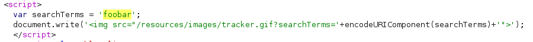

# Lab: Reflected XSS into a JavaScript string with single quote and backslash escaped

Lab-Link: <https://portswigger.net/web-security/cross-site-scripting/contexts/lab-javascript-string-single-quote-backslash-escaped>  
Difficulty: PRACTITIONER  
Python script: [script.py](script.py)  

## Known information

- Application has a reflected XSS vulnerability in the search tracking
- Single quotes and backslashes are escaped
- Goals:
  - Raise an `alert` box

## Steps

As usual, the first step is to analyse the application and the vulnerable feature. Using a generic search term shows that the string is echoed back in two places, the blog header and the search tracking:

Next I use `xX';!--"<XSS>=\&{()}Xx` to obtain some information about characters that might be encoded, escaped or blocked.

It turns out that the blog header looks decent, but the tracking script does not:

.

It does not terminate the string by adding a backslash in front of the single quote. It also escapes the backslash, which prevents me from manually escaping the backslash escaping the single quote (what a nightmare of a sentence). However, it does not prevent me from using `<>` in my custom tag.

If I can insert `script` tags than I may be able to exploit the fact that the HTML parser has a go on the code before the JavaScript parser does.

If I use `</script>` within the search term, than the HTML parser will treat this as the end of the script. Of course, this is syntactically invalid JavaScript, but the HTML parser has no notion of this.

Than I can start a new ``

Using this as search term results in the following HTML:

Some parts of the script are shown as plain text, and the `img` tag references a somewhat weird search term. But my injected script is handed to and executed by the JavaScript parser as intended and raises the `alert` box.

At the same time the lab updates to

